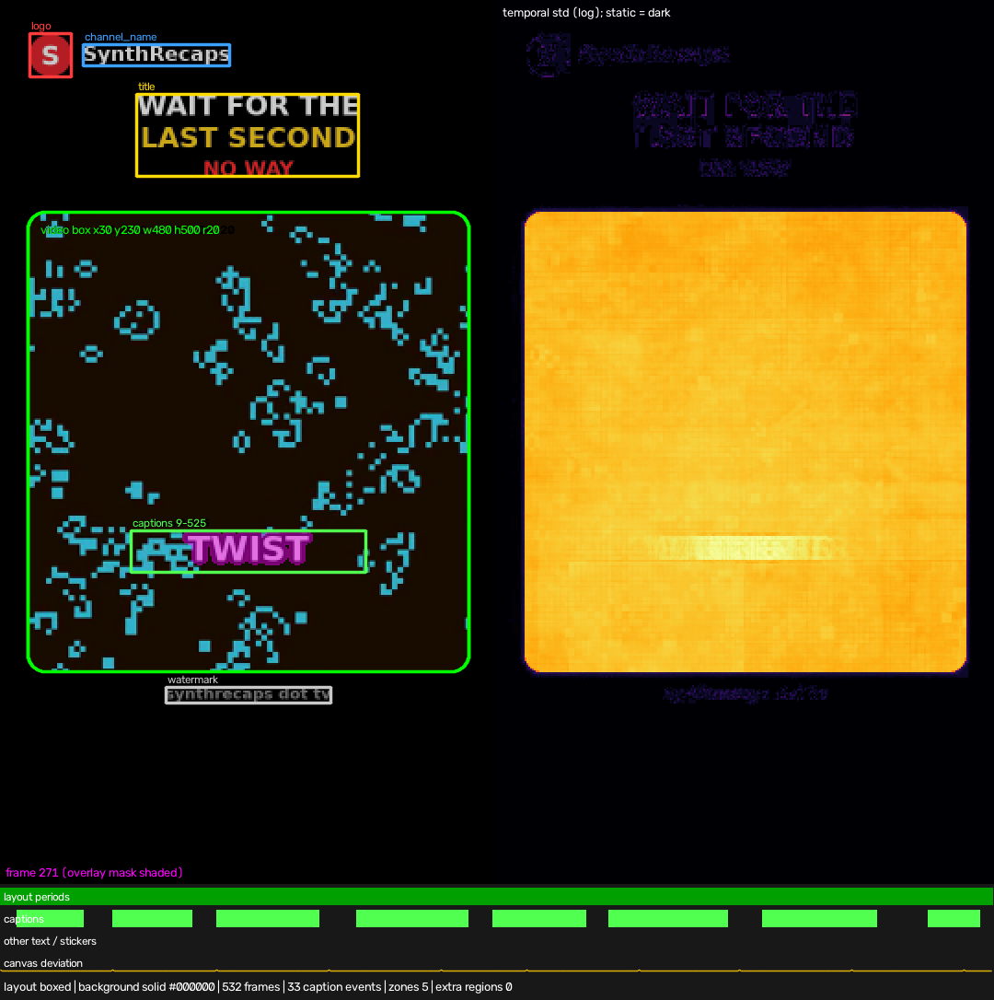
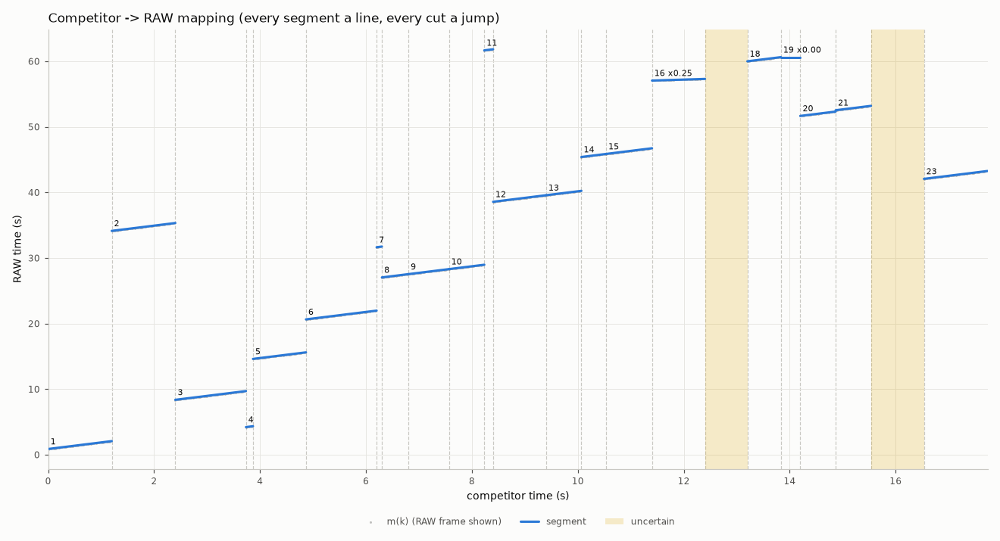
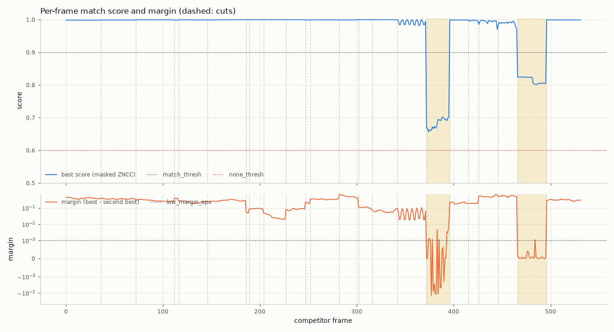

# Match cuts report: competitor.mp4 rebuilt from raw.mp4

## 1. Acceptance criteria

**Overall: FAIL**

| Criterion | Status | Evidence |
|---|---|---|
| 1. Full coverage | PASS | 23 segments (0 NOT-IN-RAW), 532/532 frames covered, 0 gaps, 0 overlaps (0 transitions) |
| 2. Frame-exact cuts | PASS (with exceptions) | 22 cuts: 21 verified both sides, 1 exceptions, 0 failed |
| 3. Frame-exact source frames | FAIL | AE sim: plan: 478/478 exact (30 on a Frame Mix's dominant frame), 0 ambiguous-identical, 0 timing-tie, 0 re-assigned, 0 mismatched (100.0000% ok); plan vs cutlist: 0 differing frame(s) (0 transition, 54 placeholder/dip frames checked); visual: 478 matched frames, min ZNCC 0.85402, median 0.99921, 39 below 0.9; 0 blend frames, 0 uniform, 54 placeholder frames checked [preview_recreation.mp4]; delivered preview: 532 frames at 30/1 fps, 540x960; temporal: 475 frame pairs, 213 with a competitor repeat/move label (54 repeat, 210 move, 52 unknown, 215 cut); 11 disagree, 1 motion mismatch(es); +-1 refit: 478 matched frames refitted with RAW j-1 / j / j+1: 0 where a neighbour wins (100.0000% ok); uncertain: 54 uncertain frames in 2 segment(s) |
| 4. Speed / framing / flip / rotation | PASS | 21 raw segments: 0 problems, 0 exceptions |
| 5. Audio | PASS (with exceptions) | 16 segments measured, max \|residual\| 0.01 ms, 6 explained exceptions, 0 failures; A/V offset -85.4 ms (raw sync) confirmed |
| 6. After Effects | PASS | mock run: 19/19 checks ok (mock only: After Effects not installed) |
| 9.7 Determinism | PASS | cutlist re-assembled from caches is byte-identical |
| 9.8 Deliverables | PASS | 9/9 deliverables present, 1 skipped (recreated_edit.aep (After Effects not installed)), exports validated, 0 stage errors |

_Criterion 6 was verified with the strict ExtendScript/After Effects mock (After Effects is not installed on this machine). Run `build_ae_project.jsx` in After Effects to create `recreated_edit.aep`._

## 2. Inputs

### Competitor

| property | value |
|---|---|
| file | /home/user/MovieRecaps/work/synthetic/film24/competitor.mp4 |
| container | mp4 |
| video codec / profile | h264 High |
| pixel format / range | yuv420p |
| coded size | 540×960 |
| display size | 540×960 |
| SAR / DAR | 1/1 / 9/16 |
| rotation | 0° |
| r_frame_rate / avg_frame_rate | 30/1 / 30/1 |
| nominal fps | 30/1 (30.000) |
| decoded frames | 532 |
| duration | 00:17.733 (17.733s) |
| CFR / VFR | CFR (PTS jitter 0.000 frames) |
| start times (v / a) / A-V offset | 0.000000s / 0.000000s / 0.000 ms |
| edit list | no |
| audio | aac 44100 Hz × 2 ch |
| AE issues | none (AE-safe) |
| imported by AE | media/competitor_ref.mp4 |
| conform | not needed — AE-safe; hardlink into media/ unchanged |
| conform verification | frames=532, identical=True, method=copy, ok=True |

### RAW

| property | value |
|---|---|
| file | /home/user/MovieRecaps/work/synthetic/film24/raw.mp4 |
| container | mp4 |
| video codec / profile | h264 High |
| pixel format / range | yuv420p |
| coded size | 960×540 |
| display size | 960×540 |
| SAR / DAR | 1/1 / 16/9 |
| rotation | 0° |
| r_frame_rate / avg_frame_rate | 24000/1001 / 24000/1001 |
| nominal fps | 24000/1001 (23.976) |
| decoded frames | 1608 |
| duration | 01:07.067 (67.067s) |
| CFR / VFR | CFR (PTS jitter 0.000 frames) |
| start times (v / a) / A-V offset | 0.000000s / 0.000000s / 0.000 ms |
| edit list | no |
| audio | aac 48000 Hz × 1 ch |
| AE issues | none (AE-safe) |
| imported by AE | media/raw.mp4 |
| conform | not needed — AE-safe; hardlink into media/ unchanged |
| conform verification | frames=1608, identical=True, method=copy, ok=True |

Timeline: MAIN comp 540×960 at 30/1 (30.000) (layout `match`, comp size `competitor`, fps mode `competitor`, AE time mode `auto`). Max cut error from the fps mode: 0.000 ms.

## 3. Detected layout

- Layout kind: **boxed** (recreated in `match` mode)
- Canvas: #000000
- Video box: x 30.00, y 230.00, w 480.00, h 500.00 (competitor px, CORNER convention), corner radius 20.00 px
- Background: solid (color #000000, gray 0.0)

| zone | x | y | w | h | frames | notes |
|---|---|---|---|---|---|---|
| logo | 32 | 36 | 46 | 48 | all |  compact blob (canvas); colours #e2242f 56%, #dd262f 23%, #fefafa 9% |
| channel_name | 90 | 48 | 160 | 24 | all |  text next to the logo; colours #fafafa 85%, #d5d5d5 14% |
| title | 148 | 102 | 242 | 90 | all |  multicolour; text block above the box; colours #fefefe 40%, #f8d024 20%, #fdd01b 20%, #fc2d30 9% |
| captions | 142 | 576 | 256 | 46 | 9–525 |  33 caption events; white text with dark outline, median glyph height 26 px |
| watermark | 180 | 746 | 180 | 18 | all |  below the box; colours #787878 53%, #8a8a8a 46% |

- Captions: 33 caption events, frames 9–525 (masked out of matching; placeholder guides in AE)
- Layout periods: 0–532 boxed

## 4. Segments

| # | comp in–out (tc / frames) | duration | RAW in–out (tc) | speed | flip | scale / position | transition | confidence | notes |
|---|---|---|---|---|---|---|---|---|---|
| S01 | 00:00:00:00–00:00:01:06 (0–36) | 36f / 1.200s | 00:00:00:20–00:00:02:00 (raw_in 0.866105s) | 1.0000 |  | s 0.9335 · (-178.1, 228.0) |  | 1.00 | J/L audio 0/6f |
| S02 | 00:00:01:06–00:00:02:12 (36–72) | 36f / 1.200s | 00:00:34:02–00:00:35:06 (raw_in 34.132770s) | 1.0000 |  | s 0.9333 · (-178.0, 228.0) |  | 1.00 | J/L audio 6/0f |
| S03 | 00:00:02:12–00:00:03:22 (72–112) | 40f / 1.333s | 00:00:08:08–00:00:09:15 (raw_in 8.366103s) | 1.0000 |  | animated (2 keys, linear) |  | 1.00 | animated framing: 2 keys, scale 1.4933->1.4937, easing linear |
| S04 | 00:00:03:22–00:00:03:26 (112–116) | 4f / 0.133s | 00:00:04:04–00:00:04:07 (raw_in 4.199440s) | 1.0000 |  | s 0.9335 · (-178.1, 228.0) |  | 1.00 |  |
| S05 | 00:00:03:26–00:00:04:26 (116–146) | 30f / 1.000s | 00:00:14:14–00:00:15:13 (raw_in 14.599438s) | 1.0000 |  | animated (3 keys, ease_in) |  | 1.00 | animated framing: 3 keys, scale 1.4930->1.4944, easing ease_in; PySceneDetect change at 124: inside a continuous mapping (same RAW line; measured framing continuous, model on the measurement): motion, lighting or overlay change -- not a cut; PySceneDetect change at 128: caption change (layout caption event 116-128) |
| S06 | 00:00:04:26–00:00:06:06 (146–186) | 40f / 1.333s | 00:00:20:14–00:00:21:21 (raw_in 20.632769s) | 1.0000 |  | s 0.9336 · (-178.1, 227.9) |  | 1.00 |  |
| S07 | 00:00:06:06–00:00:06:09 (186–189) | 3f / 0.100s | 00:00:31:14–00:00:31:16 (raw_in 31.633719s) | 1.0000 |  | s 0.9330 · (-177.9, 228.0) |  | 1.00 | audio: too_short |
| S08 | 00:00:06:09–00:00:06:24 (189–204) | 15f / 0.500s | 00:00:27:00–00:00:27:11 (raw_in 27.032769s) | 1.0000 |  | s 0.9335 · (-178.1, 228.0) |  | 1.00 | time line shared with segment(s) [204,227), [227,247) (one phase solve) |
| S09 | 00:00:06:24–00:00:07:17 (204–227) | 23f / 0.767s | 00:00:27:12–00:00:28:05 (raw_in 27.532769s) | 1.0000 |  | s 1.1663 · (-330.0, 184.9) |  | 1.00 | time line shared with segment(s) [189,204), [227,247) (one phase solve) |
| S10 | 00:00:07:17–00:00:08:07 (227–247) | 20f / 0.667s | 00:00:28:06–00:00:28:21 (raw_in 28.299436s) | 1.0000 |  | s 1.0270 · (-202.9, 190.6) |  | 1.00 | time line shared with segment(s) [189,204), [204,227) (one phase solve) |
| S11 | 00:00:08:07–00:00:08:12 (247–252) | 5f / 0.167s | 00:01:01:14–00:01:01:17 (raw_in 61.665854s) | 1.0000 |  | s 0.9333 · (-178.0, 228.0) |  | 1.00 | audio: too_short |
| S12 | 00:00:08:12–00:00:09:12 (252–282) | 30f / 1.000s | 00:00:38:12–00:00:39:11 (raw_in 38.566108s) | 1.0000 |  | animated (2 keys, linear) |  | 1.00 | time line shared with segment(s) [282,302) (one phase solve); animated framing: 2 keys, scale 1.0269->1.0270, easing linear |
| S13 | 00:00:09:12–00:00:10:02 (282–302) | 20f / 0.667s | 00:00:39:12–00:00:40:03 (raw_in 39.566108s) | 1.0000 |  | s 1.0268 · (-208.9, 202.7) |  | 1.00 | time line shared with segment(s) [252,282) (one phase solve) |
| S14 | 00:00:10:02–00:00:10:16 (302–316) | 14f / 0.467s | 00:00:45:08–00:00:45:18 (raw_in 45.399440s) | 1.0000 |  | s 0.9335 · (-178.1, 228.0) |  | 1.00 | time line shared with segment(s) [316,342) (one phase solve) |
| S15 | 00:00:10:16–00:00:11:12 (316–342) | 26f / 0.867s | 00:00:45:19–00:00:46:15 (raw_in 45.866106s) | 1.0000 |  | animated (3 keys, linear) |  | 1.00 | time line shared with segment(s) [302,316) (one phase solve); animated framing: 3 keys, scale 1.5873->1.5883, easing linear |
| S16 | 00:00:11:12–00:00:12:12 (342–372) | 30f / 1.000s | 00:00:57:00–00:00:57:05 (raw_in 57.057217s) | 0.2500 frame blend (Frame Mix) |  | s 0.9336 · (-178.2, 228.0) |  | 0.99 | frame-blend retiming verified: 24/30 frames are blends of adjacent RAW frames on one path at speed 0.25 (measured 0.25004); every frame matches the Frame Mix of the path (AE Frame Blending > Frame Mix); retime frame_blend; audio line (own in-point at speed 1) |
| S17 | 00:00:12:12–00:00:13:06 (372–396) | 24f / 0.800s | UNCERTAIN - best RAW 1370-1384, ZNCC 0.66-0.70 (00:00:12:12-00:00:13:06) |  |  |  |  | 0.00 | unresolved: best hypotheses score in [none_thresh, match_thresh) on 24/24 frames (no match, no NOT-IN-RAW claim); UNCERTAIN; audio: uncertain |
| S18 | 00:00:13:06–00:00:13:25 (396–415) | 19f / 0.633s | 00:00:59:22–00:01:00:12 (raw_in 59.999441s) | 1.0000 |  | s 0.9335 · (-178.1, 228.0) |  | 1.00 |  |
| S19 | 00:00:13:25–00:00:14:06 (415–426) | 11f / 0.367s | 00:01:00:13–00:01:00:13 (raw_in 60.612635s) | freeze |  | s 0.9333 · (-177.9, 228.0) |  | 0.99 | speed-only cut (no RAW jump): cut may lie anywhere in [415, 416]; freeze frame on RAW 1453; cut ambiguous [415, 416]; audio line (S18 continued) |
| S20 | 00:00:14:06–00:00:14:26 (426–446) | 20f / 0.667s | 00:00:51:14–00:00:52:05 (raw_in 51.666102s) | 1.0000 |  | animated (2 keys, linear) |  | 0.99 | animated framing: 2 keys, scale 1.3997->1.4000, easing linear |
| S21 | 00:00:14:26–00:00:15:16 (446–466) | 20f / 0.667s | 00:00:52:11–00:00:53:02 (raw_in 52.532773s) | 1.0000 |  | animated (2 keys, linear) |  | 0.98 | animated framing: 2 keys, scale 1.4000->1.4006, easing linear |
| S22 | 00:00:15:16–00:00:16:16 (466–496) | 30f / 1.000s | UNCERTAIN - best RAW 1513-1589, ZNCC 0.80-0.83 (00:00:15:16-00:00:16:16) |  |  |  |  | 0.00 | unresolved: best hypotheses score in [none_thresh, match_thresh) on 30/30 frames (no match, no NOT-IN-RAW claim); UNCERTAIN; audio: uncertain |
| S23 | 00:00:16:16–00:00:17:22 (496–532) | 36f / 1.200s | 00:00:42:00–00:00:43:04 (raw_in 42.066105s) | 1.0000 |  | s 0.9334 · (-178.0, 228.0) |  | 1.00 |  |

Mapping plot (competitor time → RAW time): 

Scores: 

## 5. Edit-style breakdown

- Segments: 23 (21 from RAW), cuts: 22
- Shot length: mean 0.76s, median 0.67s (min 0.10s, max 1.33s)
- RAW used: 358 of 1608 frames (22.3 %)
- RAW ranges cut out (largest first): 00:01:01:18–00:01:07:00 (126f, 5.26s), 00:00:21:22–00:00:27:00 (122f, 5.09s), 00:00:15:14–00:00:20:14 (120f, 5.00s), 00:00:09:16–00:00:14:14 (118f, 4.92s), 00:00:46:16–00:00:51:14 (118f, 4.92s), 00:00:04:08–00:00:08:08 (96f, 4.00s), 00:00:53:03–00:00:57:00 (93f, 3.88s), 00:00:35:07–00:00:38:12 (77f, 3.21s), 00:00:28:22–00:00:31:14 (64f, 2.67s), 00:00:57:06–00:00:59:22 (64f, 2.67s), 00:00:31:17–00:00:34:02 (57f, 2.38s), 00:00:02:01–00:00:04:04 (51f, 2.13s)
- Order: non-chronological — S03, S04, S08, S12, S20, S23 jump back in RAW time
- Speed factors: 1.000× (19 segments)
- Freeze / reverse / ramp (time-remapped): S16, S19
- Zoom punch-ins: 3 (S08→S09 ×1.249, S09→S10 ×0.881, S14→S15 ×1.701)
- Reframes on one time line (cuts without a RAW skip): 4 (S08→S09, S09→S10, S12→S13, S14→S15)
- Animated zooms/pans: 6 (S03, S05, S12, S15, S20, S21)
- Horizontal flips: 0
- Rotation: 0 segments
- Transitions: hard cuts only
- Captions: 33 events, typical duration 0.40s (band y≈582px, height≈26px)
- Static overlays: channel_name, logo, title, watermark
- Added audio (not recreated): music 00:00:00:00–00:00:17:22 (-6.1 dB)
- Audio: status ok; L-cut at comp frame 36 (S01|S02): audio trails by 6 frames; continuous audio line (own in-point at speed 1) under comp frames 342-371 (S16): one audio layer on that line instead of silence; continuous audio line (S18 continued) under comp frames 415-425 (S19): one audio layer on that line instead of silence; added music comp frames 0-531 (-6.1 dB re original, -23.4 dBFS)
- Audio sync: competitor audio is 85.4 ms later than its picture, relative to RAW's own A/V sync (lag -85.4 ms, interval -86.6 … -84.2 ms, 16 segment(s), coverage 100%; a property of the input files, measured); the competitor's audio switches +47.9 ms after each picture cut (switch baseline over 3 strong cut(s)); export keeps RAW lip-sync (--audio-sync raw)

## 6. Warnings

- Low-confidence frames (conf < 0.5): 54 — 372-395 (00:00:12:12), 466-495 (00:00:15:16) — see `debug/low_confidence/`
- Ambiguous-identical frames (neighbouring RAW frames identical): 0 — none
- Timing-tie frames (AE floor/round may differ by one frame): 0 — none
- NOT-IN-RAW ranges (every hypothesis below none_thresh): none
- UNCERTAIN ranges (best hypothesis between none_thresh and match_thresh: neither matched nor NOT-IN-RAW; criterion-3 failures, a guide layer of the best evidence in AE): 372–395 (00:00:12:12–00:00:13:06) UNCERTAIN - best RAW 1370-1384, ZNCC 0.66-0.70 (00:00:12:12-00:00:13:06); 466–495 (00:00:15:16–00:00:16:16) UNCERTAIN - best RAW 1513-1589, ZNCC 0.80-0.83 (00:00:15:16-00:00:16:16)
- AE-rule-sensitive segments (exact floor-rule slack below 0.01 RAW frame although more was possible): none
- Motion mismatch (s9_2b): S19 holds one RAW frame on frames 415–425 while the competitor moves
- Temporal signature disagrees with the competitor (s9_2b, 11 of 475 frame pairs k|k+1): recreation jumps at 122; recreation repeats at 415-424
- Anything AE can't reproduce: S16: frame-blend retiming (verified path; exported with AE Frame Blending > Frame Mix); S17: uncertain — unresolved: best hypotheses score in [none_thresh, match_thresh) on 24/24 frames (no match, no NOT-IN-RAW claim); S22: uncertain — unresolved: best hypotheses score in [none_thresh, match_thresh) on 30/30 frames (no match, no NOT-IN-RAW claim)

All warnings:

- S16: competitor used frame-blend retiming at speed 0.25 - verified path, exported with AE Frame Mix
- UNCERTAIN: comp frames 372-395 (00:00:12:12-00:00:13:06) - 'UNCERTAIN - best RAW 1370-1384, ZNCC 0.66-0.70 (00:00:12:12-00:00:13:06)' (neither matched nor NOT-IN-RAW: rebuild by hand from the guide layer)
- UNCERTAIN: comp frames 466-495 (00:00:15:16-00:00:16:16) - 'UNCERTAIN - best RAW 1513-1589, ZNCC 0.80-0.83 (00:00:15:16-00:00:16:16)' (neither matched nor NOT-IN-RAW: rebuild by hand from the guide layer)
- verification: c3_source_frames: 39 matched frames below ZNCC 0.9: [[427, 465]]
- verification: c3_source_frames: motion mismatch: S19 holds one RAW frame on frames 415-425 while the competitor moves (10 of its pairs change)
- verification: c3_source_frames: temporal signature differs from the competitor on 11/475 frame pairs (97.6842% agree < 99%): recreation jumps: pairs k = [[122, 122]]; recreation repeats: pairs k = [[415, 424]]
- verification: c3_source_frames: 54 frames in 2 UNCERTAIN segment(s) (neither matched nor NOT-IN-RAW): S17 372-395 UNCERTAIN - best RAW 1370-1384, ZNCC 0.66-0.70 (00:00:12:12-00:00:13:06); S22 466-495 UNCERTAIN - best RAW 1513-1589, ZNCC 0.80-0.83 (00:00:15:16-00:00:16:16)

## 7. Verification details

| Check | Status | Summary |
|---|---|---|
| s9_1_coverage | PASS | 23 segments (0 NOT-IN-RAW), 532/532 frames covered, 0 gaps, 0 overlaps (0 transitions) |
| s9_2b_temporal | FAIL | 475 frame pairs, 213 with a competitor repeat/move label (54 repeat, 210 move, 52 unknown, 215 cut); 11 disagree, 1 motion mismatch(es) |
| s9_2c_refit | PASS | 478 matched frames refitted with RAW j-1 / j / j+1: 0 where a neighbour wins (100.0000% ok) |
| s9_2_ae_sim | PASS | plan: 478/478 exact (30 on a Frame Mix's dominant frame), 0 ambiguous-identical, 0 timing-tie, 0 re-assigned, 0 mismatched (100.0000% ok); plan vs cutlist: 0 differing frame(s) (0 transition, 54 placeholder/dip frames checked) \| mock record: 478/478 exact (30 on a Frame Mix's dominant frame), 0 ambiguous-identical, 0 timing-tie, 0 re-assigned, 0 mismatched (100.0000% ok); plan vs cutlist: 0 differing frame(s) (0 transition, 54 placeholder/dip frames checked) |
| s9_3_visual | FAIL | 478 matched frames, min ZNCC 0.85402, median 0.99921, 39 below 0.9; 0 blend frames, 0 uniform, 54 placeholder frames checked [preview_recreation.mp4]; delivered preview: 532 frames at 30/1 fps, 540x960 |
| s9_4_cut_images | PASS | 22/22 cut images in examples/synthetic_film24/debug/cuts |
| s9_5_audio | PASS (with exceptions) | 16 segments measured, max \|residual\| 0.01 ms, 6 explained exceptions, 0 failures; A/V offset -85.4 ms (raw sync) confirmed |
| s9_6_ae_render | N/A | aerender not available on this machine (criterion 6 is mock-only) |
| s9_7_determinism | PASS | cutlist re-assembled from caches is byte-identical |
| s9_8_deliverables | PASS | 9/9 deliverables present, 1 skipped (recreated_edit.aep (After Effects not installed)), exports validated, 0 stage errors |

Visual ZNCC over matched frames (preview_recreation.mp4): min 0.85402, p1 0.85936, p5 0.87652, median 0.99921, mean 0.984; threshold 0.9.

| ZNCC bin | frames |
|---|---|
| -1.00-0.50 | 0 |
| 0.50-0.80 | 0 |
| 0.80-0.90 | 39 |
| 0.90-0.95 | 1 |
| 0.95-0.98 | 43 |
| 0.98-0.99 | 50 |
| 0.99-1.01 | 345 |
Failure thumbnails: `debug/verify_failures/` (39 frames).

Temporal signature (competitor-only labels of the frame pairs k|k+1): 54 repeat, 210 move, 52 unknown, 215 cut; 11 pairs where the recreation disagrees, 1 motion mismatch(es).

Independent checks (they never reuse an analysis decision):

- Motion mismatch (s9_2b): S19 holds one RAW frame on frames 415–425 while the competitor moves
- Temporal signature disagrees with the competitor (s9_2b, 11 of 475 frame pairs k|k+1): recreation jumps at 122; recreation repeats at 415-424

A/V offset: published -85.438 ms (raw sync), measured here -85.438 ms over 16 segment(s), tolerance ±3.376 ms: confirmed; every segment is judged on its residual after the expected lag -85.438 ms.

Audio per segment (analysis rate 16000 Hz; tolerance ±10.0 ms):

| segment | result | lag ms | residual ms | corr | code | checked as |
|---|---|---|---|---|---|---|
| S01 | ok | -85.439 | -0.001 | 0.9105 |  |  |
| S02 | ok | -85.438 | 0.0 | 0.8571 |  |  |
| S03 | ok | -85.438 | -0.0 | 0.9061 |  |  |
| S04 | exception |  |  |  | too_short | run S04 |
| S05 | ok | -85.438 | 0.0 | 0.874 |  |  |
| S06 | ok | -85.439 | -0.001 | 0.9153 |  |  |
| S07 | exception |  |  |  | too_short | run S07 |
| S08 | ok | -85.439 | -0.001 | 0.9228 |  |  |
| S09 | ok | -85.433 | 0.005 | 0.8381 |  |  |
| S10 | ok | -85.444 | -0.006 | 0.9289 |  |  |
| S11 | exception |  |  |  | too_short | run S11 |
| S12 | ok | -85.438 | 0.0 | 0.8628 |  |  |
| S13 | ok | -85.438 | -0.0 | 0.9258 |  |  |
| S14 | exception |  |  |  | too_short | run S14 |
| S15 | ok | -85.437 | 0.001 | 0.8848 |  |  |
| S16 | ok | -85.438 | -0.0 | 0.884 |  |  |
| S17 | uncertain |  |  |  | uncertain |  |
| S18 | ok | -85.439 | -0.001 | 0.866 |  |  |
| S19 | exception |  |  |  | too_short | run S19 |
| S20 | ok | -85.438 | -0.0 | 0.9079 |  |  |
| S21 | ok | -85.438 | 0.0 | 0.8861 |  |  |
| S22 | uncertain |  |  |  | uncertain |  |
| S23 | ok | -85.438 | 0.0 | 0.9122 |  |  |

Cuts (competitor vs recreation images in `debug/cuts/cut_XX.png`):

| cut | frame | kind | status | failed |
|---|---|---|---|---|
| 01: S01\|S02 | 36 (00:00:01:06) | hard | pass |  |
| 02: S02\|S03 | 72 (00:00:02:12) | hard | pass |  |
| 03: S03\|S04 | 112 (00:00:03:22) | hard | pass |  |
| 04: S04\|S05 | 116 (00:00:03:26) | hard | pass |  |
| 05: S05\|S06 | 146 (00:00:04:26) | hard | pass |  |
| 06: S06\|S07 | 186 (00:00:06:06) | hard | pass |  |
| 07: S07\|S08 | 189 (00:00:06:09) | hard | pass |  |
| 08: S08\|S09 | 204 (00:00:06:24) | hard | pass |  |
| 09: S09\|S10 | 227 (00:00:07:17) | hard | pass |  |
| 10: S10\|S11 | 247 (00:00:08:07) | hard | pass |  |
| 11: S11\|S12 | 252 (00:00:08:12) | hard | pass |  |
| 12: S12\|S13 | 282 (00:00:09:12) | hard | pass |  |
| 13: S13\|S14 | 302 (00:00:10:02) | hard | pass |  |
| 14: S14\|S15 | 316 (00:00:10:16) | hard | pass |  |
| 15: S15\|S16 | 342 (00:00:11:12) | hard | pass |  |
| 16: S16\|S17 | 372 (00:00:12:12) | raw_to_uncertain | pass |  |
| 17: S17\|S18 | 396 (00:00:13:06) | uncertain_to_raw | pass |  |
| 18: S18\|S19 | 415 (00:00:13:25) | hard | exception |  |
| 19: S19\|S20 | 426 (00:00:14:06) | hard | pass |  |
| 20: S20\|S21 | 446 (00:00:14:26) | hard | pass |  |
| 21: S21\|S22 | 466 (00:00:15:16) | raw_to_uncertain | pass |  |
| 22: S22\|S23 | 496 (00:00:16:16) | uncertain_to_raw | pass |  |

After Effects mock run:

- [x] jsx ran without exception
- [x] no strict-mock violations
- [x] no error alerts
- [x] one balanced undo group
- [x] MAIN comp created
- [x] MAIN frameRate == main_fps
- [x] MAIN duration == frames * frameDuration
- [x] work area == whole comp
- [x] MAIN width
- [x] MAIN height
- [x] saved <script dir>/recreated_edit.aep
- [x] one RAW video layer per segment
- [x] every plan layer present with the plan's name/startTime/stretch/in/out
- [x] media_missing: no exception
- [x] media_missing: File.openDialog called
- [x] media_missing: aborted without saving
- [x] media_missing: clean abort message
- [x] new_project_null: clean abort
- [x] no_marker_property: still builds and saves

Failures:

- c3_source_frames: 39 matched frames below ZNCC 0.9: [[427, 465]]
- c3_source_frames: motion mismatch: S19 holds one RAW frame on frames 415-425 while the competitor moves (10 of its pairs change)
- c3_source_frames: temporal signature differs from the competitor on 11/475 frame pairs (97.6842% agree < 99%): recreation jumps: pairs k = [[122, 122]]; recreation repeats: pairs k = [[415, 424]]
- c3_source_frames: 54 frames in 2 UNCERTAIN segment(s) (neither matched nor NOT-IN-RAW): S17 372-395 UNCERTAIN - best RAW 1370-1384, ZNCC 0.66-0.70 (00:00:12:12-00:00:13:06); S22 466-495 UNCERTAIN - best RAW 1513-1589, ZNCC 0.80-0.83 (00:00:15:16-00:00:16:16)

## 8. How to open in After Effects

1. Copy the whole output folder (the `.jsx` finds `media/` next to itself; keep them together).
2. After Effects → **File → Scripts → Run Script File…** → `build_ae_project.jsx`.
3. The script creates a new project with the `Recreated Edit` comp and saves `recreated_edit.aep` next to the script. If saving fails, enable **Preferences → Scripting & Expressions → Allow Scripts to Write Files and Access Network** (in versions before 16.1: Preferences → General) and run it again.
4. If the RAW media is not found next to the script (`media/raw.mp4`), the script tries the absolute path and then opens a *Locate the RAW video* dialog (relink).
5. Reference layer: `REFERENCE – competitor` sits on top as a guide layer in *Difference* mode, switched off. Turn its video switch on: black means the recreation matches the competitor exactly. Guide layers never render.
6. Guide layers outline the header / title / caption / watermark zones — drop your own assets there. `MISSING – not in RAW` solids mark the ranges that have to be filled with your own footage.
7. Alternative route: import `recreated_edit.xml` (FCP7 XML) in Premiere Pro or DaVinci Resolve.

## 9. Outputs

| output | path | what |
|---|---|---|
| cutlist | cutlist.json | cut list (source of truth) |
| jsx | build_ae_project.jsx | After Effects build script |
| csv | cutlist.csv | cut list, one row per segment |
| xml | recreated_edit.xml | FCP7 XML (Premiere / Resolve) |
| edl | recreated_edit.edl | CMX3600 EDL |
| preview | preview_recreation.mp4 | frame-exact preview render |
| compare | compare.mp4 | competitor \| recreation \| difference |
| verify | verify.json | verification results |
| media | media | AE-imported media |
| debug | debug | debug plots, cut images, failure thumbnails |
| decisions | debug/decisions.jsonl | decision log (evidence) |
| log | ../../../../../../../../tmp/claude-0/-home-user-MovieRecaps/3b916d17-eb3b-5132-8532-5d0eb96d13a5/scratchpad/w4rpd/ex_film24_work/match_cuts.log | run log |
| frame_map | ../../../../../../../../tmp/claude-0/-home-user-MovieRecaps/3b916d17-eb3b-5132-8532-5d0eb96d13a5/scratchpad/w4rpd/ex_film24_work/frame_map.npz | per-frame mapping m(k) |

## 10. Environment and timings

- OS: Linux-6.18.44-fc-v50-x86_64-with-glibc2.39, Python 3.12.3, ffmpeg 6.1.1, Node v22.22.2
- After Effects: not installed; aerender: not installed
- match_cuts 0.1.0

| stage | seconds |
|---|---|
| S0 env | 0.14 |
| S2 probe+conform | 2.68 |
| S3 audio | 0.65 |
| S5.1 audio align | 2.30 |
| S3 proxies | 5.01 |
| S4 layout | 3.49 |
| S5.2 visual search | 41.74 |
| S5.3 refine | 65.53 |
| S5.4-S6 segments+cutlist | 6.82 |
| S7 AE project | 0.65 |
| S8.preview | 7.24 |
| S8.compare | 9.05 |
| S8 exports | 16.38 |
| S9 verify | 53.25 |
| total | 199.22 |
