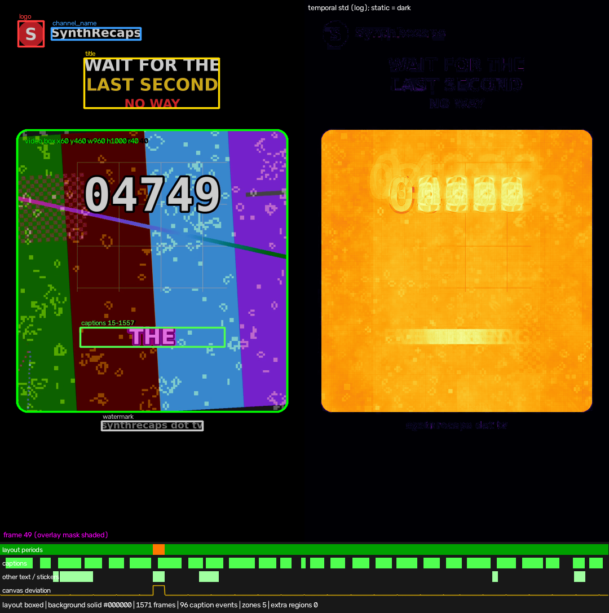
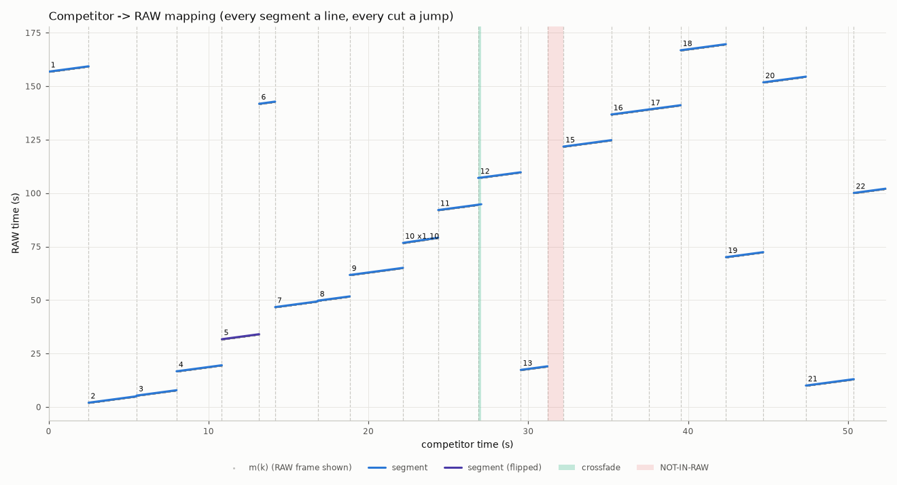
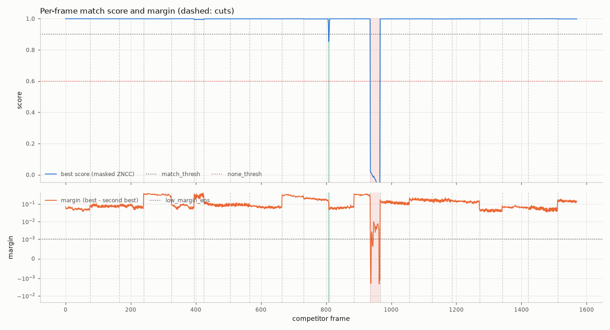

# Match cuts report: competitor.mp4 rebuilt from raw.mp4

## 1. Acceptance criteria

**Overall: PASS**

| Criterion | Status | Evidence |
|---|---|---|
| 1. Full coverage | PASS | 22 segments (1 NOT-IN-RAW), 1571/1571 frames covered, 0 gaps, 1 overlaps (1 transitions), 1 full-screen period(s) |
| 2. Frame-exact cuts | PASS | 21 cuts: 21 verified both sides, 0 exceptions, 0 failed |
| 3. Frame-exact source frames | PASS | AE sim: plan: 1535/1535 exact, 0 ambiguous-identical, 0 timing-tie, 0 re-assigned, 0 mismatched (100.0000% ok); plan vs cutlist: 0 differing frame(s) (6 transition, 30 placeholder/dip frames checked); visual: 1535 matched frames, min ZNCC 0.99039, median 0.99958, 0 below 0.9; 6 blend frames (min 0.98769), 0 uniform, 30 placeholder frames checked [preview_recreation.mp4]; delivered preview: 1571 frames at 30/1 fps, 1080x1920; temporal: 1532 frame pairs, 0 with a competitor repeat/move label (0 repeat, 0 move, 1260 unknown, 308 cut); 0 disagree, 0 motion mismatch(es); +-1 refit: 1535 matched frames refitted with RAW j-1 / j / j+1: 0 where a neighbour wins (100.0000% ok); uncertain: 0 uncertain frames in 0 segment(s) |
| 4. Speed / framing / flip / rotation | PASS | 21 raw segments: 0 problems, 0 exceptions |
| 5. Audio | PASS (with exceptions) | 21 segments measured, max \|lag\| 0.77 ms, 1 explained exceptions, 0 failures |
| 6. After Effects | PASS | mock run: 19/19 checks ok (mock only: After Effects not installed) |
| 9.7 Determinism | PASS | cutlist re-assembled from caches is byte-identical |
| 9.8 Deliverables | PASS | 9/9 deliverables present, 1 skipped (recreated_edit.aep (After Effects not installed)), exports validated, 0 stage errors |

_Criterion 6 was verified with the strict ExtendScript/After Effects mock (After Effects is not installed on this machine). Run `build_ae_project.jsx` in After Effects to create `recreated_edit.aep`._

## 2. Inputs

### Competitor

| property | value |
|---|---|
| file | /home/user/MovieRecaps/.claude/worktrees/wf_b0a2be3c-657-2/work/synthetic/full/competitor.mp4 |
| container | mp4 |
| video codec / profile | h264 High |
| pixel format / range | yuv420p |
| coded size | 1080×1920 |
| display size | 1080×1920 |
| SAR / DAR | 1/1 / 9/16 |
| rotation | 0° |
| r_frame_rate / avg_frame_rate | 30/1 / 30/1 |
| nominal fps | 30/1 (30.000) |
| decoded frames | 1571 |
| duration | 00:52.367 (52.367s) |
| CFR / VFR | CFR (PTS jitter 0.000 frames) |
| start times (v / a) / A-V offset | 0.000000s / 0.000000s / 0.000 ms |
| edit list | no |
| audio | aac 48000 Hz × 2 ch |
| AE issues | none (AE-safe) |
| imported by AE | media/competitor_ref.mp4 |
| conform | not needed — AE-safe; hardlink into media/ unchanged |
| conform verification | frames=1571, identical=True, method=copy, ok=True |

### RAW

| property | value |
|---|---|
| file | /home/user/MovieRecaps/.claude/worktrees/wf_b0a2be3c-657-2/work/synthetic/full/raw.mp4 |
| container | mp4 |
| video codec / profile | h264 High |
| pixel format / range | yuv420p |
| coded size | 1920×1080 |
| display size | 1920×1080 |
| SAR / DAR | 1/1 / 16/9 |
| rotation | 0° |
| r_frame_rate / avg_frame_rate | 30000/1001 / 30000/1001 |
| nominal fps | 30000/1001 (29.970) |
| decoded frames | 5400 |
| duration | 03:00.180 (180.180s) |
| CFR / VFR | CFR (PTS jitter 0.000 frames) |
| start times (v / a) / A-V offset | 0.000000s / 0.000000s / 0.000 ms |
| edit list | no |
| audio | aac 48000 Hz × 1 ch |
| AE issues | none (AE-safe) |
| imported by AE | media/raw.mp4 |
| conform | not needed — AE-safe; hardlink into media/ unchanged |
| conform verification | frames=5400, identical=True, method=copy, ok=True |

Timeline: MAIN comp 1080×1920 at 30/1 (30.000) (layout `match`, comp size `competitor`, fps mode `competitor`, AE time mode `auto`). Max cut error from the fps mode: 0.000 ms.

## 3. Detected layout

- Layout kind: **boxed** (recreated in `match` mode)
- Canvas: #000000
- Video box: x 60.00, y 460.00, w 960.00, h 1000.00 (competitor px, CORNER convention), corner radius 40.00 px
- Background: solid (color #000000, gray 0.0)

| zone | x | y | w | h | frames | notes |
|---|---|---|---|---|---|---|
| logo | 64 | 74 | 92 | 92 | all |  compact blob (canvas); colours #e1252e 73%, #fefdfc 11%, #dc2730 9% |
| channel_name | 182 | 98 | 318 | 44 | all |  text next to the logo; colours #fefefe 95% |
| title | 298 | 206 | 480 | 178 | all |  multicolour; text block above the box; colours #ffffff 41%, #fdd01c 24%, #fbd023 16%, #fe2e30 12% |
| captions | 284 | 1160 | 514 | 70 | 15–1557 |  96 caption events; white text with dark outline, median glyph height 54 px |
| watermark | 360 | 1492 | 360 | 34 | all |  below the box; colours #8b8b8b 91%, #7a7a7a 8% |

- Captions: 96 caption events, frames 15–1557 (masked out of matching; placeholder guides in AE)
- Other overlaid text / stickers: 6 text events
- Layout periods: 0–395 boxed, 395–425 fullscreen (reproduced: full-canvas layers in MAIN), 425–1571 boxed
- Note: frames 395-424 show the video fullscreen (not boxed): their segments cover the whole canvas in the recreation (per-segment box)

## 4. Segments

| # | comp in–out (tc / frames) | duration | RAW in–out (tc) | speed | flip | scale / position | transition | confidence | notes |
|---|---|---|---|---|---|---|---|---|---|
| S01 | 00:00:00:00–00:00:02:15 (0–75) | 75f / 2.500s | 00:02:36;24–00:02:39;08 (raw_in 156.826511s) | 1.0000 |  | s 0.9260 · (-348.9, 460.0) |  | 1.00 |  |
| S02 | 00:00:02:15–00:00:05:15 (75–165) | 90f / 3.000s | 00:00:02;00–00:00:04;29 (raw_in 2.005653s) | 1.0000 |  | s 0.9259 · (-348.9, 460.0) |  | 1.00 |  |
| S03 | 00:00:05:15–00:00:08:00 (165–240) | 75f / 2.500s | 00:00:05;10–00:00:07;24 (raw_in 5.341844s) | 1.0000 |  | s 0.9259 · (-348.9, 460.0) |  | 1.00 |  |
| S04 | 00:00:08:00–00:00:10:25 (240–325) | 85f / 2.833s | 00:00:16;20–00:00:19;14 (raw_in 16.686827s) | 1.0000 |  | s 0.9260 · (-349.1, 460.0) |  | 1.00 |  |
| S05 | 00:00:10:25–00:00:13:05 (325–395) | 70f / 2.333s | 00:00:31;20–00:00:33;29 (raw_in 31.701352s) | 1.0000 | yes | s 0.9260 · (-349.1, 460.0) |  | 1.00 |  |
| S06 | 00:00:13:05–00:00:14:05 (395–425) | 30f / 1.000s | 00:02:21;24–00:02:22;23 (raw_in 141.810086s) | 1.0000 |  | s 1.7777 · (-1166.6, 0.2) |  | 0.99 | fullscreen layout period (frames 395-424): shown on the whole canvas |
| S07 | 00:00:14:05–00:00:16:25 (425–505) | 80f / 2.667s | 00:00:46;20–00:00:49;09 (raw_in 46.716669s) | 1.0000 |  | s 0.9260 · (-349.0, 460.0) |  | 1.00 |  |
| S08 | 00:00:16:25–00:00:18:25 (505–565) | 60f / 2.000s | 00:00:49;20–00:00:51;19 (raw_in 49.719036s) | 1.0000 |  | s 0.9259 · (-349.0, 460.0) |  | 1.00 |  |
| S09 | 00:00:18:25–00:00:22:05 (565–665) | 100f / 3.333s | 00:01:01;22–00:01:05;01 (raw_in 61.732303s) | 1.0000 |  | animated (2 keys, linear) |  | 1.00 | animated framing: 2 keys, scale 0.9260->1.0371, easing linear |
| S10 | 00:00:22:05–00:00:24:11 (665–731) | 66f / 2.200s | 00:01:16;22–00:01:19;03 (raw_in 76.759067s) | 1.1000 |  | s 0.9260 · (-349.1, 460.0) |  | 1.00 |  |
| S11 | 00:00:24:11–00:00:27:02 (731–812) | 81f / 2.700s | 00:01:32;02–00:01:34;21 (raw_in 92.094650s) | 1.0000 |  | s 0.9260 · (-349.0, 460.0) | out: crossfade 6f | 0.99 |  |
| S12 | 00:00:26:26–00:00:29:16 (806–886) | 80f / 2.667s | 00:01:47;02–00:01:49;21 (raw_in 107.110336s) | 1.0000 |  | s 0.9260 · (-349.0, 460.0) | in: crossfade 6f | 1.00 | crossfade in: O=806, D=6 frames (B's frame at 806 inferred, invisible) |
| S13 | 00:00:29:16–00:00:31:06 (886–936) | 50f / 1.667s | 00:00:17;10–00:00:18;29 (raw_in 17.353053s) | 1.0000 |  | s 1.0353 · (-333.9, 431.0) |  | 1.00 |  |
| S14 | 00:00:31:06–00:00:32:06 (936–966) | 30f / 1.000s | MISSING - not in RAW (00:00:31:06-00:00:32:06) |  |  |  |  | 0.98 | no RAW match (NOT-IN-RAW placeholder); audio: not_in_raw |
| S15 | 00:00:32:06–00:00:35:06 (966–1056) | 90f / 3.000s | 00:02:01;24–00:02:04;23 (raw_in 121.791986s) | 1.0000 |  | s 0.9260 · (-349.0, 460.0) |  | 1.00 |  |
| S16 | 00:00:35:06–00:00:37:16 (1056–1126) | 70f / 2.333s | 00:02:16;24–00:02:19;03 (raw_in 136.808253s) | 1.0000 |  | s 0.9259 · (-348.9, 460.0) |  | 1.00 | time line shared with segment(s) [1126,1186) (one phase solve) |
| S17 | 00:00:37:16–00:00:39:16 (1126–1186) | 60f / 2.000s | 00:02:19;04–00:02:21;03 (raw_in 139.141586s) | 1.0000 |  | s 1.1573 · (-571.1, 335.0) |  | 0.99 | time line shared with segment(s) [1056,1126) (one phase solve) |
| S18 | 00:00:39:16–00:00:42:11 (1186–1271) | 85f / 2.833s | 00:02:46;24–00:02:49;18 (raw_in 166.836827s) | 1.0000 |  | s 0.9260 · (-349.1, 460.0) |  | 1.00 |  |
| S19 | 00:00:42:11–00:00:44:21 (1271–1341) | 70f / 2.333s | 00:01:10;02–00:01:12;11 (raw_in 70.073019s) | 1.0000 |  | s 0.9815 · (-462.2, 400.0) |  | 1.00 |  |
| S20 | 00:00:44:21–00:00:47:11 (1341–1421) | 80f / 2.667s | 00:02:31;24–00:02:34;13 (raw_in 151.821669s) | 1.0000 |  | s 0.9260 · (-349.0, 460.0) |  | 1.00 |  |
| S21 | 00:00:47:11–00:00:50:11 (1421–1511) | 90f / 3.000s | 00:00:10;00–00:00:12;29 (raw_in 10.013652s) | 1.0000 |  | s 0.9259 · (-348.9, 460.0) |  | 1.00 |  |
| S22 | 00:00:50:11–00:00:52:11 (1511–1571) | 60f / 2.000s | 00:01:40;02–00:01:42;01 (raw_in 100.102703s) | 1.0000 |  | s 0.9259 · (-349.0, 460.0) |  | 1.00 |  |

Mapping plot (competitor time → RAW time): 

Scores: 

## 5. Edit-style breakdown

- Segments: 22 (21 from RAW), cuts: 21
- Shot length: mean 2.46s, median 2.50s (min 1.00s, max 3.33s)
- RAW used: 1502 of 5400 frames (27.8 %)
- RAW ranges cut out (largest first): 00:01:19;04–00:01:32;02 (388f, 12.95s), 00:00:34;00–00:00:46;20 (380f, 12.68s), 00:00:19;15–00:00:31;20 (365f, 12.18s), 00:01:49;22–00:02:01;24 (360f, 12.01s), 00:02:04;24–00:02:16;24 (360f, 12.01s), 00:02:49;19–00:03:00;06 (315f, 10.51s), 00:00:51;20–00:01:01;22 (300f, 10.01s), 00:02:22;24–00:02:31;24 (270f, 9.01s), 00:02:39;09–00:02:46;24 (225f, 7.51s), 00:01:34;22–00:01:40;02 (160f, 5.34s), 00:01:05;02–00:01:10;02 (150f, 5.00s), 00:01:42;02–00:01:47;02 (150f, 5.00s)
- Order: non-chronological — S02, S07, S13, S19, S21 jump back in RAW time (the opening is a hook taken from later in RAW)
- Re-used RAW moments: frames 520–569 in S04 and S13
- Speed factors: 1.000× (20 segments), 1.100× (1 segment)
- Zoom punch-ins: 1 (S16→S17 ×1.250)
- Reframes on one time line (cuts without a RAW skip): 1 (S16→S17)
- Animated zooms/pans: 1 (S09)
- Horizontal flips: 1 (S05)
- Rotation: 0 segments
- Transitions: crossfade ×1
- Captions: 96 events, typical duration 0.40s (band y≈1166px, height≈54px)
- Static overlays: channel_name, logo, title, watermark
- Other overlaid text / stickers: text ×6
- Added audio (not recreated): music 00:00:00:00–00:00:52:11 (-6.4 dB)
- Audio: status ok; added music comp frames 0-1570 (-6.4 dB re original, -23.6 dBFS)
- Audio sync: competitor audio is in sync with its picture, relative to RAW's own A/V sync (0 ms is consistent with 21 segment(s), coverage 100%)

## 6. Warnings

- Low-confidence frames (conf < 0.5): 2 — 808-809 (00:00:26:28) — see `debug/low_confidence/`
- Ambiguous-identical frames (neighbouring RAW frames identical): 0 — none
- Timing-tie frames (AE floor/round may differ by one frame): 0 — none
- NOT-IN-RAW ranges (every hypothesis below none_thresh): 936–965 (00:00:31:06–00:00:32:06)
- UNCERTAIN ranges (best hypothesis between none_thresh and match_thresh: neither matched nor NOT-IN-RAW; criterion-3 failures, a guide layer of the best evidence in AE): none
- Phase pinned by cadence (information, not a risk): 1 segment(s) — S11 (±0.017 ms, audio in-point) — raw_in is fixed inside one breakpoint cell of the 30000/1001-in-30/1 cadence (maximal information); exported frame-exact (time-remap HOLD keys at j + 0.25) because After Effects' time resolution is unverified (s9_6)
- AE-rule-sensitive segments (exact floor-rule slack below 0.01 RAW frame although more was possible): none
- Full-screen periods (reproduced: full-canvas layers directly in MAIN): 395–424 (00:00:13:05–00:00:14:05)
- Anything AE can't reproduce: nothing detected

All warnings:

- NOT-IN-RAW: comp frames 936-965 (00:00:31:06-00:00:32:06) - placeholder 'MISSING - not in RAW (00:00:31:06-00:00:32:06)'

## 7. Verification details

| Check | Status | Summary |
|---|---|---|
| s9_1_coverage | PASS | 22 segments (1 NOT-IN-RAW), 1571/1571 frames covered, 0 gaps, 1 overlaps (1 transitions), 1 full-screen period(s) |
| s9_2b_temporal | PASS | 1532 frame pairs, 0 with a competitor repeat/move label (0 repeat, 0 move, 1260 unknown, 308 cut); 0 disagree, 0 motion mismatch(es) |
| s9_2c_refit | PASS | 1535 matched frames refitted with RAW j-1 / j / j+1: 0 where a neighbour wins (100.0000% ok) |
| s9_2_ae_sim | PASS | plan: 1535/1535 exact, 0 ambiguous-identical, 0 timing-tie, 0 re-assigned, 0 mismatched (100.0000% ok); plan vs cutlist: 0 differing frame(s) (6 transition, 30 placeholder/dip frames checked) \| mock record: 1535/1535 exact, 0 ambiguous-identical, 0 timing-tie, 0 re-assigned, 0 mismatched (100.0000% ok); plan vs cutlist: 0 differing frame(s) (6 transition, 30 placeholder/dip frames checked) |
| s9_3_visual | PASS | 1535 matched frames, min ZNCC 0.99039, median 0.99958, 0 below 0.9; 6 blend frames (min 0.98769), 0 uniform, 30 placeholder frames checked [preview_recreation.mp4]; delivered preview: 1571 frames at 30/1 fps, 1080x1920 |
| s9_4_cut_images | PASS | 21/21 cut images in examples/synthetic_full/debug/cuts |
| s9_5_audio | PASS (with exceptions) | 21 segments measured, max \|lag\| 0.77 ms, 1 explained exceptions, 0 failures |
| s9_6_ae_render | N/A | aerender not available on this machine (criterion 6 is mock-only) |
| s9_7_determinism | PASS | cutlist re-assembled from caches is byte-identical |
| s9_8_deliverables | PASS | 9/9 deliverables present, 1 skipped (recreated_edit.aep (After Effects not installed)), exports validated, 0 stage errors |

Visual ZNCC over matched frames (preview_recreation.mp4): min 0.99039, p1 0.99063, p5 0.99541, median 0.99958, mean 0.99878; threshold 0.9.

| ZNCC bin | frames |
|---|---|
| -1.00-0.50 | 0 |
| 0.50-0.80 | 0 |
| 0.80-0.90 | 0 |
| 0.90-0.95 | 0 |
| 0.95-0.98 | 0 |
| 0.98-0.99 | 0 |
| 0.99-1.01 | 1535 |

Temporal signature (competitor-only labels of the frame pairs k|k+1): 0 repeat, 0 move, 1260 unknown, 308 cut; 0 pairs where the recreation disagrees, 0 motion mismatch(es).

Audio per segment (original rate 48000 Hz; tolerance ±10.0 ms):

| segment | result | lag ms | residual ms | corr | code | checked as |
|---|---|---|---|---|---|---|
| S01 | ok | -0.698 | -0.698 | 0.8985 |  |  |
| S02 | ok | -0.674 | -0.674 | 0.9023 |  |  |
| S03 | ok | -0.699 | -0.699 | 0.9001 |  |  |
| S04 | ok | -0.683 | -0.683 | 0.9034 |  |  |
| S05 | ok | -0.706 | -0.706 | 0.8861 |  |  |
| S06 | ok | -0.774 | -0.774 | 0.8992 |  |  |
| S07 | ok | -0.689 | -0.689 | 0.8993 |  |  |
| S08 | ok | -0.723 | -0.723 | 0.8981 |  |  |
| S09 | ok | -0.657 | -0.657 | 0.9043 |  |  |
| S10 | ok | -0.288 | -0.288 | 0.8987 |  |  |
| S11 | ok | 0.016 | 0.016 | 0.8789 |  |  |
| S12 | ok | -0.689 | -0.689 | 0.8863 |  |  |
| S13 | ok | -0.739 | -0.739 | 0.8992 |  |  |
| S14 | exception |  |  |  | not_in_raw |  |
| S15 | ok | -0.673 | -0.673 | 0.8999 |  |  |
| S16 | ok | -0.606 | -0.606 | 0.9056 |  |  |
| S17 | ok | -0.606 | -0.606 | 0.9024 |  |  |
| S18 | ok | -0.681 | -0.681 | 0.9036 |  |  |
| S19 | ok | -0.707 | -0.707 | 0.9045 |  |  |
| S20 | ok | -0.69 | -0.69 | 0.9035 |  |  |
| S21 | ok | -0.674 | -0.674 | 0.9038 |  |  |
| S22 | ok | -0.723 | -0.723 | 0.9032 |  |  |

Cuts (competitor vs recreation images in `debug/cuts/cut_XX.png`):

| cut | frame | kind | status | failed |
|---|---|---|---|---|
| 01: S01\|S02 | 75 (00:00:02:15) | hard | pass |  |
| 02: S02\|S03 | 165 (00:00:05:15) | hard | pass |  |
| 03: S03\|S04 | 240 (00:00:08:00) | hard | pass |  |
| 04: S04\|S05 | 325 (00:00:10:25) | hard | pass |  |
| 05: S05\|S06 | 395 (00:00:13:05) | hard | pass |  |
| 06: S06\|S07 | 425 (00:00:14:05) | hard | pass |  |
| 07: S07\|S08 | 505 (00:00:16:25) | hard | pass |  |
| 08: S08\|S09 | 565 (00:00:18:25) | hard | pass |  |
| 09: S09\|S10 | 665 (00:00:22:05) | hard | pass |  |
| 10: S10\|S11 | 731 (00:00:24:11) | hard | pass |  |
| 11: S11\|S12 | 806 (00:00:26:26) | crossfade | pass |  |
| 12: S12\|S13 | 886 (00:00:29:16) | hard | pass |  |
| 13: S13\|S14 | 936 (00:00:31:06) | raw_to_placeholder | pass |  |
| 14: S14\|S15 | 966 (00:00:32:06) | placeholder_to_raw | pass |  |
| 15: S15\|S16 | 1056 (00:00:35:06) | hard | pass |  |
| 16: S16\|S17 | 1126 (00:00:37:16) | hard | pass |  |
| 17: S17\|S18 | 1186 (00:00:39:16) | hard | pass |  |
| 18: S18\|S19 | 1271 (00:00:42:11) | hard | pass |  |
| 19: S19\|S20 | 1341 (00:00:44:21) | hard | pass |  |
| 20: S20\|S21 | 1421 (00:00:47:11) | hard | pass |  |
| 21: S21\|S22 | 1511 (00:00:50:11) | hard | pass |  |

After Effects mock run:

- [x] jsx ran without exception
- [x] no strict-mock violations
- [x] no error alerts
- [x] one balanced undo group
- [x] MAIN comp created
- [x] MAIN frameRate == main_fps
- [x] MAIN duration == frames * frameDuration
- [x] work area == whole comp
- [x] MAIN width
- [x] MAIN height
- [x] saved <script dir>/recreated_edit.aep
- [x] one RAW video layer per segment
- [x] every plan layer present with the plan's name/startTime/stretch/in/out
- [x] media_missing: no exception
- [x] media_missing: File.openDialog called
- [x] media_missing: aborted without saving
- [x] media_missing: clean abort message
- [x] new_project_null: clean abort
- [x] no_marker_property: still builds and saves

## 8. How to open in After Effects

1. Copy the whole output folder (the `.jsx` finds `media/` next to itself; keep them together).
2. After Effects → **File → Scripts → Run Script File…** → `build_ae_project.jsx`.
3. The script creates a new project with the `Recreated Edit` comp and saves `recreated_edit.aep` next to the script. If saving fails, enable **Preferences → Scripting & Expressions → Allow Scripts to Write Files and Access Network** (in versions before 16.1: Preferences → General) and run it again.
4. If the RAW media is not found next to the script (`media/raw.mp4`), the script tries the absolute path and then opens a *Locate the RAW video* dialog (relink).
5. Reference layer: `REFERENCE – competitor` sits on top as a guide layer in *Difference* mode, switched off. Turn its video switch on: black means the recreation matches the competitor exactly. Guide layers never render.
6. Guide layers outline the header / title / caption / watermark zones — drop your own assets there. `MISSING – not in RAW` solids mark the ranges that have to be filled with your own footage.
7. Alternative route: import `recreated_edit.xml` (FCP7 XML) in Premiere Pro or DaVinci Resolve.

## 9. Outputs

| output | path | what |
|---|---|---|
| cutlist | cutlist.json | cut list (source of truth) |
| jsx | build_ae_project.jsx | After Effects build script |
| csv | cutlist.csv | cut list, one row per segment |
| xml | recreated_edit.xml | FCP7 XML (Premiere / Resolve) |
| edl | recreated_edit.edl | CMX3600 EDL |
| preview | preview_recreation.mp4 | frame-exact preview render |
| compare | compare.mp4 | competitor \| recreation \| difference |
| verify | verify.json | verification results |
| media | media | AE-imported media |
| debug | debug | debug plots, cut images, failure thumbnails |
| decisions | debug/decisions.jsonl | decision log (evidence) |
| log | ../../../../../../../../tmp/claude-0/-home-user-MovieRecaps/3b916d17-eb3b-5132-8532-5d0eb96d13a5/scratchpad/w4rpd/ex_full_work/match_cuts.log | run log |
| frame_map | ../../../../../../../../tmp/claude-0/-home-user-MovieRecaps/3b916d17-eb3b-5132-8532-5d0eb96d13a5/scratchpad/w4rpd/ex_full_work/frame_map.npz | per-frame mapping m(k) |

## 10. Environment and timings

- OS: Linux-6.18.44-fc-v50-x86_64-with-glibc2.39, Python 3.12.3, ffmpeg 6.1.1, Node v22.22.2
- After Effects: not installed; aerender: not installed
- match_cuts 0.1.0

| stage | seconds |
|---|---|
| S0 env | 0.14 |
| S2 probe+conform | 27.82 |
| S3 audio | 1.33 |
| S5.1 audio align | 5.85 |
| S3 proxies | 41.26 |
| S4 layout | 14.15 |
| S5.2 visual search | 257.87 |
| S5.3 refine | 193.09 |
| S5.4-S6 segments+cutlist | 25.79 |
| S7 AE project | 0.80 |
| S8.preview | 89.40 |
| S8.compare | 50.12 |
| S8 exports | 139.64 |
| S9 verify | 322.71 |
| total | 1032.73 |
