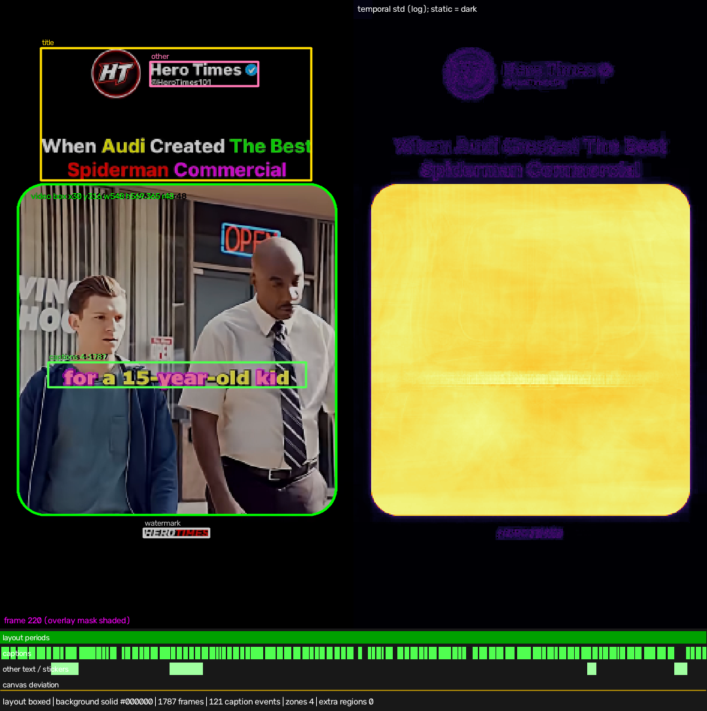
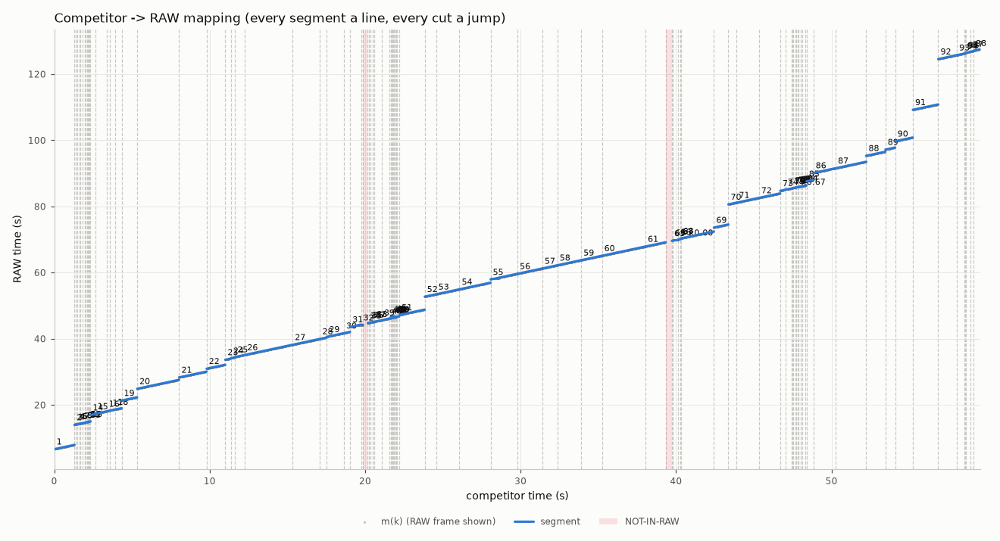
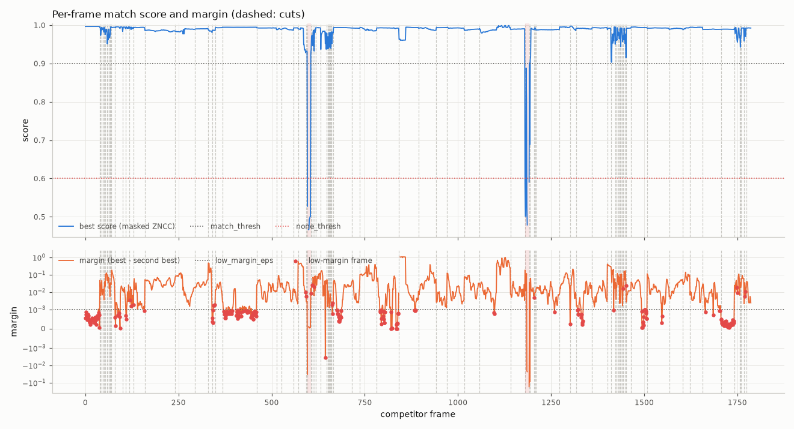

# Match cuts report: competitor.mp4 rebuilt from raw.mp4

## 1. Summary

**Result: FAIL**

| What was checked | Result |
|---|---|
| Every frame of the competitor video is rebuilt or marked. | OK |
| Every cut is on the right frame. | NOT OK |
| Every frame shows the right frame of your RAW video. | NOT OK |
| Speed, zoom, position, flip and rotation are right. | NOT OK |
| The sound lines up with the picture. | NOT OK |
| The After Effects script builds the project. | not checked |

What failed and why:

- Frames 542–544 (00:00:18:02): the tool is not sure which RAW frame this is (UNCERTAIN - best RAW 3025-3051, ZNCC 0.86-0.95 (00:00:18:02-00:00:18:05)). It did not guess. These frames count as a failure of check 3.
- Other problem: c2_cuts: cut S01|S02 at frame 25: A_last (k=24): own 0.764679 vs other 0.931144; no_cut: spurious cut: both sides show the same RAW frames and the re-measured framing is continuous (extrapolation errors [0.393, 0.73] px, [3e-05, 9e-05] scale)
- Other problem: c2_cuts: cut S06|S07 at frame 249: no_cut: spurious cut: both sides show the same RAW frames and the re-measured framing is continuous (extrapolation errors [0.351, 0.253] px, [5e-05, 2e-05] scale)
- Other problem: c2_cuts: cut S09|S10 at frame 272: A_last (k=271): own 0.985306 vs other 0.996733; no_cut: spurious cut: S10's time line extended over the other side explains both sides within the score noise (delta 0.0015, framing re-measured)
- Other problem: c2_cuts: cut S12|S13 at frame 386: B_first (k=386): own 0.966483 vs other 0.977393; no_cut: spurious cut: both sides show the same RAW frames and the re-measured framing is continuous (extrapolation errors [0.582, 0.071] px, [8e-05, 0.00018] scale)
- Other problem: c2_cuts: cut S15|S16 at frame 414: no_cut: spurious cut: both sides show the same RAW frames and the re-measured framing is continuous (extrapolation errors [3.594, 1.291] px, [9e-05, 8e-05] scale)
- Other problem: c3_source_frames: 6 matched frames below ZNCC 0.9: [[23, 24], [160, 160], [398, 398], [515, 516]]
- Other problem: c4_speed_framing: S01: framing off on frames [[22, 24]] (max scale err 0.08%, pos 14.05 px, rot 0.000°)
- Other problem: c4_speed_framing: S04: framing off on frames [[160, 160]] (max scale err 0.02%, pos 6.61 px, rot 0.000°)
- ... and 15 more (see 'Verification details').

Check by hand in After Effects:

- Frames 31–113 (00:00:01:01): this part is not in your RAW video. Put your own footage on the 'MISSING' solid in After Effects.
- Frames 542–544: rebuild them by hand. The 'UNCERTAIN' guide layer in After Effects shows the best RAW frames the tool found.
- Frames 596–668 (00:00:19:26): this part is not in your RAW video. Put your own footage on the 'MISSING' solid in After Effects.
- Frames 161–168: your RAW video shows text or a graphic at x 1128, y 930 (size 144 × 78 RAW pixels) that the competitor does not show. The After Effects project shows it too. If you do not want it, add a mask or a blur there in After Effects.

Headlines:

- Audio: competitor audio is 53.9 ms later than its picture, relative to RAW's own A/V sync (lag -53.9 ms, interval -54.4 … -53.4 ms, 15 segment(s), coverage 84%; a property of the input files, measured); the competitor's audio switches +33.3 ms after each picture cut (switch baseline over 3 strong cut(s)); export keeps RAW lip-sync (--audio-sync raw).
- Uncertain: 3 frames in 1 segment(s) — 542–544.
- RAW-only overlays: 1 — RAW-only overlay at 1128,930,144,78 (x,y,w,h in RAW px) over frames 161-168: not shown by the competitor (segment(s) S05).
- Phases pinned by the cadence (information, not a risk): 2 segment(s).

## 2. Acceptance criteria

**Overall: FAIL**

| Criterion | Status | Evidence |
|---|---|---|
| 1. Full coverage | PASS | 23 segments (2 NOT-IN-RAW), 700/700 frames covered, 0 gaps, 0 overlaps (0 transitions) |
| 2. Frame-exact cuts | FAIL | 22 cuts: 17 verified both sides, 0 exceptions, 5 failed |
| 3. Frame-exact source frames | FAIL | AE sim: Premiere-only run (--premiere): no After Effects export; visual: 541 matched frames, min ZNCC 0.76342, median 0.99676, 6 below 0.9; 0 blend frames, 0 uniform, 159 placeholder frames checked [preview_recreation.mp4]; delivered preview: 700 frames at 30/1 fps, 608x1080; temporal: 537 frame pairs, 523 with a competitor repeat/move label (44 repeat, 617 move, 15 unknown, 23 cut); 2 disagree, 0 motion mismatch(es); +-1 refit: 541 matched frames refitted with RAW j-1 / j / j+1: 0 where a neighbour wins (100.0000% ok); uncertain: 3 uncertain frames in 1 segment(s) |
| 4. Speed / framing / flip / rotation | FAIL | 20 raw segments: 11 problems, 9 exceptions |
| 5. Audio | FAIL | 15 segments measured, max \|residual\| 4.83 ms, 8 explained exceptions, 6 failures; A/V offset -53.9 ms (raw sync) confirmed |
| 6. After Effects | N/A | Premiere-only run (--premiere): no After Effects export |
| 9.7 Determinism | PASS | cutlist re-assembled from caches is byte-identical; previous run not compared (input_hashes, code_hash changed) |
| 9.8 Deliverables | PASS | 8/8 deliverables present, 2 skipped (build_ae_project.jsx (Premiere-only run, --premiere); recreated_edit.aep (Premiere-only run, --premiere)), exports validated, 0 stage errors |

_Criterion 6 was verified with the strict ExtendScript/After Effects mock (After Effects is not installed on this machine). Run `build_ae_project.jsx` in After Effects to create `recreated_edit.aep`._

## 3. Inputs

### Competitor

| property | value |
|---|---|
| file | C:\Users\gvida\Desktop\bh\MovieRecaps\input\competitor.mp4 |
| container | mp4 |
| video codec / profile | av1 Main |
| pixel format / range | yuv420p tv |
| coded size | 608×1080 |
| display size | 608×1080 |
| SAR / DAR | 1/1 / 76/135 |
| rotation | 0° |
| r_frame_rate / avg_frame_rate | 30/1 / 30/1 |
| nominal fps | 30/1 (30.000) |
| decoded frames | 700 |
| duration | 00:23.333 (23.333s) |
| CFR / VFR | CFR (PTS jitter 0.000 frames) |
| start times (v / a) / A-V offset | 0.000000s / 0.000000s / 0.000 ms |
| edit lists (elst, per track) | video track 1: 1 entry (media_time 0/15360 = 0.000000 s, duration 23.334 s); audio track 2: 1 entry (media_time 0/44100 = 0.000000 s, duration 23.383 s) |
| iTunSMPB (encoder gapless info) | absent |
| stream durations (video / audio) | video 23.333 s / audio 23.382 s |
| audio | aac 44100 Hz × 2 ch |
| AE issues | vcodec: av1 is not H.264/ProRes |
| imported by AE | media/competitor_ref.mp4 |
| conform | transcoded — not AE-safe: vcodec: av1 is not H.264/ProRes -> transcoded to H.264 + AAC 48 kHz, CFR re-stamped by frame index at 30/1 fps, 608x1080, start 0 |
| conform verification | encode_fps=536.83, encode_seconds=1.304, fps_actual=30/1, fps_expected=30/1, frames_actual=700, frames_expected=700, frames_source=700, informative=64, median_ssim=0.99907, method=restamp, min_margin=0.0, min_ssim=0.9987, n_failed=0, ok=True, samples=64, seconds=1.229 |

### RAW

| property | value |
|---|---|
| file | C:\Users\gvida\Desktop\bh\MovieRecaps\input\raw.mp4 |
| container | mp4 |
| video codec / profile | h264 High |
| pixel format / range | yuv420p tv |
| coded size | 1920×1080 |
| display size | 1920×1080 |
| SAR / DAR | 1/1 / 16/9 |
| rotation | 0° |
| r_frame_rate / avg_frame_rate | 30000/1001 / 30000/1001 |
| nominal fps | 30000/1001 (29.970) |
| decoded frames | 6091 |
| duration | 03:23.236 (203.236s) |
| CFR / VFR | CFR (PTS jitter 0.000 frames) |
| start times (v / a) / A-V offset | 0.000000s / 0.000000s / 0.000 ms |
| edit lists (elst, per track) | video track 1: 1 entry (media_time 2002/30000 = 0.066733 s, duration 203.237 s); audio track 2: 1 entry (media_time 688/48000 = 0.014333 s, duration 203.263 s) |
| iTunSMPB (encoder gapless info) | absent |
| stream durations (video / audio) | video 203.236 s / audio 203.263 s |
| audio | aac 48000 Hz × 2 ch |
| AE issues | none (AE-safe) |
| imported by AE | media/raw.mp4 |
| conform | not needed — AE-safe; hardlink into media/ unchanged |
| conform verification | frames=6091, identical=True, method=copy, ok=True |

Timeline: MAIN comp 608×1080 at 30/1 (30.000) (layout `match`, comp size `competitor`, fps mode `competitor`, AE time mode `auto`). Max cut error from the fps mode: 0.000 ms.

## 4. Detected layout

- Layout kind: **boxed** (recreated in `match` mode)
- Canvas: #000000
- Video box: x 30.52, y 315.69, w 546.96, h 570.31 (competitor px, CORNER convention), corner radius 66.00 px
- Background: solid (color #000000, gray 0.0)

| zone | x | y | w | h | frames | notes |
|---|---|---|---|---|---|---|
| title | 26 | 76 | 554 | 222 | all |  multicolour; text block above the box; colours #fcfcfc 30%, #fcf502 16%, #02fefd 11%, #77fe00 9% |
| other | 246 | 96 | 218 | 54 | all |  multicolour; text above the box; colours #fafafa 61%, #8b8b8a 11%, #2c92f4 8% |
| captions | 32 | 696 | 434 | 64 | 1–700 |  47 caption events; white text with dark outline, median glyph height 26 px |

- Captions: 47 caption events, frames 1–700 (masked out of matching; placeholder guides in AE)
- Layout periods: 0–700 boxed

## 5. Segments

| # | comp in–out (tc / frames) | duration | RAW in–out (tc) | speed | flip | scale / position | transition | confidence | notes |
|---|---|---|---|---|---|---|---|---|---|
| S01 | 00:00:00:00–00:00:00:25 (0–25) | 25f / 0.833s | 00:01:07;14–00:01:08;08 (raw_in 67.483299s) | 1.0000 |  | animated (5 keys, ease_in) |  | 0.99 | time line shared with segment(s) [25,31) (one phase solve); time/translation confounded frames 3-9, 24 (RAW m+-1 with its own framing scores within noise: soft range m+-1); framing: 2 sample(s) off the local trend of their neighbours left out (10, 24); animated framing: 5 keys, scale 0.5855->0.5855, easing ease_in |
| S02 | 00:00:00:25–00:00:01:01 (25–31) | 6f / 0.200s | 00:01:08;09–00:01:08;14 (raw_in 68.316632s) | 1.0000 |  | animated (2 keys, linear) |  | 0.99 | time line shared with segment(s) [0,25) (one phase solve); time/translation confounded frames 25-28 (RAW m+-1 with its own framing scores within noise: soft range m+-1); animated framing: 2 keys, scale 0.5854->0.5855, easing linear; J/L audio 0/1f |
| S03 | 00:00:01:01–00:00:03:24 (31–114) | 83f / 2.767s | MISSING - not in RAW (00:00:01:01-00:00:03:24) |  |  |  |  | 0.85 | no RAW match (NOT-IN-RAW placeholder); audio: not_in_raw |
| S04 | 00:00:03:24–00:00:05:11 (114–161) | 47f / 1.567s | 00:01:13;06–00:01:14;22 (raw_in 73.215575s) | 1.0000 |  | animated (8 keys, linear) |  | 0.97 | time/translation confounded frames 132-134, 136-137, 158-160 (RAW m+-1 with its own framing scores within noise: soft range m+-1); framing: 3 sample(s) off the local trend of their neighbours left out (114, 159-160); animated framing: 8 keys, scale 0.5854->0.5858, easing linear |
| S05 | 00:00:05:11–00:00:05:19 (161–169) | 8f / 0.267s | 00:01:15;01–00:01:15;08 (raw_in 75.050092s) | 1.0000 |  | animated (2 keys, ease_in) |  | 0.98 | time/translation confounded frames 161-166 (RAW m+-1 with its own framing scores within noise: soft range m+-1); animated framing: 2 keys, scale 0.5853->0.5854, easing ease_in; audio: too_short |
| S06 | 00:00:05:19–00:00:08:09 (169–249) | 80f / 2.667s | 00:01:19;08–00:01:21;27 (raw_in 79.295191s) | 1.0000 |  | animated (13 keys, ease_out) |  | 0.99 | cut at 200 removed: no frame changes (confounded, lines_meet); cut at 221 removed: no frame changes (criterion2_oscillation, lines_meet); time line shared with segment(s) [249,255) (one phase solve); time/translation confounded frames 175-178, 187-194, 196-204, 208-211, 229-247 (RAW m+-1 with its own framing scores within noise: soft range m+-1); framing: 4 sample(s) off the local trend of their neighbours left out (169-170, 177, 219); animated framing: 13 keys, scale 0.5853->0.5857, easing ease_out; edge framing not measured on frames 248 (the edge key is held there) |
| S07 | 00:00:08:09–00:00:08:15 (249–255) | 6f / 0.200s | 00:01:21;28–00:01:22;03 (raw_in 81.961857s) | 1.0000 |  | animated (2 keys, linear) |  | 0.99 | time line shared with segment(s) [169,249) (one phase solve); animated framing: 2 keys, scale 0.5855->0.5856, easing linear; edge framing not measured on frames 249-250 (the edge key is held there) |
| S08 | 00:00:08:15–00:00:09:01 (255–271) | 16f / 0.533s | 00:01:22;24–00:01:23;09 (raw_in 82.817376s) | 1.0000 |  | animated (3 keys, ease_out) |  | 0.96 | time/translation confounded frames 255-258 (RAW m+-1 with its own framing scores within noise: soft range m+-1); animated framing: 3 keys, scale 0.5854->0.5855, easing ease_out; 1 frames with identical RAW neighbours |
| S09 | 00:00:09:01–00:00:09:02 (271–272) | 1f / 0.033s | 00:01:23;18–00:01:23;18 (raw_in 83.625208s) | 1.0000 |  | s 0.5837 · (-218.2, 291.8) |  | 0.24 | time/translation confounded frames 271 (RAW m+-1 with its own framing scores within noise: soft range m+-1); audio: too_short |
| S10 | 00:00:09:02–00:00:10:03 (272–303) | 31f / 1.033s | 00:01:23;22–00:01:24;22 (raw_in 83.766233s) | 1.0000 |  | animated (4 keys, ease_in) |  | 0.96 | time/translation confounded frames 273-277, 287-290 (RAW m+-1 with its own framing scores within noise: soft range m+-1); framing: 1 sample(s) off the local trend of their neighbours left out (272); animated framing: 4 keys, scale 0.5851->0.5858, easing ease_in |
| S11 | 00:00:10:03–00:00:12:22 (303–382) | 79f / 2.633s | 00:01:25;06–00:01:27;24 (raw_in 85.228108s) | 1.0000 |  | animated (12 keys, ease_out) |  | 0.98 | cut at 305 removed: no frame changes (lines_meet); time/translation confounded frames 332-335, 350-352, 373-378, 380-381 (RAW m+-1 with its own framing scores within noise: soft range m+-1); framing: 1 sample(s) off the local trend of their neighbours left out (303); animated framing: 12 keys, scale 0.5854->0.5857, easing ease_out |
| S12 | 00:00:12:22–00:00:12:26 (382–386) | 4f / 0.133s | 00:01:28;10–00:01:28;13 (raw_in 88.363525s) | 1.0000 |  | s 0.5855 · (-228.9, 290.4) |  | 0.99 | time line shared with segment(s) [386,398) (one phase solve); audio: too_short |
| S13 | 00:00:12:26–00:00:13:08 (386–398) | 12f / 0.400s | 00:01:28;14–00:01:28;25 (raw_in 88.496858s) | 1.0000 |  | animated (3 keys, ease_in) |  | 0.90 | time line shared with segment(s) [382,386) (one phase solve); time/translation confounded frames 386-395 (RAW m+-1 with its own framing scores within noise: soft range m+-1); animated framing: 3 keys, scale 0.5854->0.5855, easing ease_in; edge framing not measured on frames 386-387, 397 (the edge key is held there); audio: too_short |
| S14 | 00:00:13:08–00:00:13:23 (398–413) | 15f / 0.500s | 00:01:29;07–00:01:29;21 (raw_in 89.266683s) | 1.0000 |  | animated (3 keys, ease_out) |  | 0.99 | time/translation confounded frames 400-408, 411-412 (RAW m+-1 with its own framing scores within noise: soft range m+-1); framing: 1 sample(s) off the local trend of their neighbours left out (398); animated framing: 3 keys, scale 0.5853->0.5855, easing ease_out; edge framing not measured on frames 412 (the edge key is held there) |
| S15 | 00:00:13:23–00:00:13:24 (413–414) | 1f / 0.033s | 00:01:29;29–00:01:29;29 (raw_in 90.000016s) | 1.0000 |  | s 0.5853 · (-260.0, 290.4) |  | 0.99 | time line shared with segment(s) [414,446) (one phase solve); no measured framing inside the segment: frame 413's used; audio: too_short |
| S16 | 00:00:13:24–00:00:14:26 (414–446) | 32f / 1.067s | 00:01:30;00–00:01:31;01 (raw_in 90.033349s) | 1.0000 |  | animated (6 keys, ease_in) |  | 0.81 | time line shared with segment(s) [413,414) (one phase solve); time/translation confounded frames 428-429, 432 (RAW m+-1 with its own framing scores within noise: soft range m+-1); animated framing: 6 keys, scale 0.5853->0.5856, easing ease_in |
| S17 | 00:00:14:26–00:00:16:10 (446–490) | 44f / 1.467s | 00:01:31;21–00:01:33;04 (raw_in 91.733349s) | 1.0000 |  | animated (8 keys, ease_in) |  | 0.99 | time/translation confounded frames 447-449, 456-459, 480-481, 483-486 (RAW m+-1 with its own framing scores within noise: soft range m+-1); framing: 4 sample(s) off the local trend of their neighbours left out (446-447, 454-455); animated framing: 8 keys, scale 0.5854->0.5856, easing ease_in |
| S18 | 00:00:16:10–00:00:17:05 (490–515) | 25f / 0.833s | 00:01:38;22–00:01:39;16 (raw_in 98.781222s) | 1.0000 |  | animated (4 keys, ease_in_out) |  | 0.71 | time/translation confounded frames 490-493, 496-497, 499-501, 508-514 (RAW m+-1 with its own framing scores within noise: soft range m+-1); framing: 2 sample(s) off the local trend of their neighbours left out (513-514); animated framing: 4 keys, scale 0.7445->0.7449, easing ease_in_out; framing measured again on frames 511-512 (RAW frame differs from refine's, or after a framing step); frames shown from the segment model instead of refine's best measurement: model 511-512 |
| S19 | 00:00:17:05–00:00:18:02 (515–542) | 27f / 0.900s | 00:01:39;28–00:01:40;23 (raw_in 99.966683s) | 1.0000 |  | animated (4 keys, ease_in) |  | 0.96 | cut at 519 removed: no frame changes (confounded, lines_meet); time/translation confounded frames 516-524 (RAW m+-1 with its own framing scores within noise: soft range m+-1); framing: 2 sample(s) off the local trend of their neighbours left out (516-517); animated framing: 4 keys, scale 0.7445->0.7448, easing ease_in; framing measured again on frames 541 (RAW frame differs from refine's, or after a framing step); edge framing not measured on frames 515 (the edge key is held there); frames shown from the segment model instead of refine's best measurement: tiny_segment_merged 541; J/L audio 0/-9f |
| S20 | 00:00:18:02–00:00:18:05 (542–545) | 3f / 0.100s | UNCERTAIN - best RAW 3025-3051, ZNCC 0.86-0.95 (00:00:18:02-00:00:18:05) |  |  |  |  | 0.00 | 1-frame RAW island 542-542 (RAW [3025]) explains its unmatched neighbour(s) [543] at [0.992] >= none_thresh: one unresolved stretch; 1-frame RAW island 544-544 (RAW [3051]) explains its unmatched neighbour(s) [542, 543] at [0.753, 0.731] >= none_thresh: one unresolved stretch; unresolved: best hypotheses score in [none_thresh, match_thresh) on 3/3 frames (no match, no NOT-IN-RAW claim); UNCERTAIN; audio: uncertain |
| S21 | 00:00:18:05–00:00:19:26 (545–596) | 51f / 1.700s | 00:01:41;19–00:01:43;08 (raw_in 101.668250s) | 1.0000 |  | animated (9 keys, ease_out) |  | 0.97 | time/translation confounded frames 547-553 (RAW m+-1 with its own framing scores within noise: soft range m+-1); framing: 1 sample(s) off the local trend of their neighbours left out (545); animated framing: 9 keys, scale 0.7445->0.7447, easing ease_out |
| S22 | 00:00:19:26–00:00:22:09 (596–669) | 73f / 2.433s | MISSING - not in RAW (00:00:19:26-00:00:22:09) |  |  |  |  | 0.97 | no RAW match (NOT-IN-RAW placeholder); audio: not_in_raw |
| S23 | 00:00:22:09–00:00:23:10 (669–700) | 31f / 1.033s | 00:01:45;22–00:01:46;22 (raw_in 105.781175s) | 1.0000 |  | animated (3 keys, ease_in) |  | 0.28 | time/translation confounded frames 670-671, 674-682, 692-699 (RAW m+-1 with its own framing scores within noise: soft range m+-1); animated framing: 3 keys, scale 0.7446->0.7447, easing ease_in |

Mapping plot (competitor time → RAW time): 

Scores: 

## 6. Edit-style breakdown

- Segments: 23 (20 from RAW), cuts: 22
- Shot length: mean 0.90s, median 0.83s (min 0.03s, max 2.67s)
- RAW used: 539 of 6091 frames (8.8 %)
- RAW ranges cut out (largest first): 00:01:46;23–00:03:23;07 (2890f, 96.43s), 00:00:00;00–00:01:07;14 (2022f, 67.47s), 00:01:33;05–00:01:38;22 (167f, 5.57s), 00:01:08;15–00:01:13;06 (141f, 4.70s), 00:01:15;09–00:01:19;08 (119f, 3.97s), 00:01:43;09–00:01:45;22 (73f, 2.44s), 00:01:40;24–00:01:41;19 (25f, 0.83s), 00:01:22;04–00:01:22;24 (20f, 0.67s), 00:01:31;02–00:01:31;21 (19f, 0.63s), 00:01:27;25–00:01:28;10 (15f, 0.50s), 00:01:24;23–00:01:25;06 (13f, 0.43s), 00:01:28;26–00:01:29;07 (11f, 0.37s)
- Order: chronological
- Speed factors: 1.000× (20 segments)
- Zoom punch-ins: 0
- Reframes on one time line (cuts without a RAW skip): 4 (S01→S02, S06→S07, S12→S13, S15→S16)
- Animated zooms/pans: 17 (S01, S02, S04, S05, S06, S07, S08, S10, S11, S13, S14, S16, S17, S18, S19, S21, S23)
- Horizontal flips: 0
- Rotation: 0 segments
- Transitions: hard cuts only
- Captions: 47 events, typical duration 0.23s (band y≈706px, height≈34px)
- Static overlays: other, title
- Added audio (not recreated): music 00:00:00:00–00:00:04:12 (-17.7 dB), sfx 00:00:05:17–00:00:06:14 (-17.4 dB), music 00:00:07:28–00:00:17:24 (-14.2 dB), music 00:00:18:25–00:00:23:10 (-12.6 dB)
- Audio: status ok; L-cut at comp frame 31 (S02|S03): audio trails by 1 frames; J-cut at comp frame 542 (S19|S20): audio leads by 9 frames; added music comp frames 0-131 (-17.7 dB re original, -35.5 dBFS); added sfx comp frames 167-193 (-17.4 dB re original, -35.2 dBFS); added music comp frames 238-533 (-14.2 dB re original, -32.4 dBFS); added music comp frames 565-699 (-12.6 dB re original, -31.8 dBFS)
- Audio sync: competitor audio is 53.9 ms later than its picture, relative to RAW's own A/V sync (lag -53.9 ms, interval -54.4 … -53.4 ms, 15 segment(s), coverage 84%; a property of the input files, measured); the competitor's audio switches +33.3 ms after each picture cut (switch baseline over 3 strong cut(s)); export keeps RAW lip-sync (--audio-sync raw)

## 7. Warnings

- Low-confidence frames (conf < 0.5): 6 — 271 (00:00:09:01), 429 (00:00:14:09), 514 (00:00:17:04), 543-545 (00:00:18:03) — see `debug/low_confidence/`
- Ambiguous-identical frames (neighbouring RAW frames identical): 1 — 255 (00:00:08:15)
- Timing-tie frames (AE floor/round may differ by one frame): 0 — none
- Low-margin frames (best RAW frame beats its neighbours by < 0.001): 34 — 137 (00:00:04:17), 271 (00:00:09:01), 288 (00:00:09:18), 380 (00:00:12:20), 397 (00:00:13:07), 428-429 (00:00:14:08), 432 (00:00:14:12), 490-491 (00:00:16:10), 510 (00:00:17:00), 513-514 (00:00:17:03), 545 (00:00:18:05), 670-671 (00:00:22:10), 673-682 (00:00:22:13), 692-699 (00:00:23:02)
- Re-assigned by segmentation (the segment model's RAW frame replaced refine's measured best frame; counted against criterion 3): 3 — 511-512 (00:00:17:01), 541 (00:00:18:01) — k 511: measured 2980 → model 2981 (score gap 0.0002); k 512: measured 2981 → model 2982 (score gap 0.0001); k 541: measured 3022 → model 3021 (score gap 0.0039)
- NOT-IN-RAW ranges (every hypothesis below none_thresh): 31–113 (00:00:01:01–00:00:03:24), 596–668 (00:00:19:26–00:00:22:09)
- UNCERTAIN ranges (best hypothesis between none_thresh and match_thresh: neither matched nor NOT-IN-RAW; criterion-3 failures, a guide layer of the best evidence in AE): 542–544 (00:00:18:02–00:00:18:05) UNCERTAIN - best RAW 3025-3051, ZNCC 0.86-0.95 (00:00:18:02-00:00:18:05)
- Phase pinned by cadence (information, not a risk): 2 segment(s) — S19 (±0.017 ms, frames), S21 (±0.017 ms, frames) — raw_in is fixed inside one breakpoint cell of the 30000/1001-in-30/1 cadence (maximal information); exported frame-exact (time-remap HOLD keys at j + 0.25) because After Effects' time resolution is unverified (s9_6)
- AE-rule-sensitive segments (exact floor-rule slack below 0.01 RAW frame although more was possible): none
- Temporal signature disagrees with the competitor (s9_2b, 2 of 537 frame pairs k|k+1): recreation jumps at 271; recreation repeats at 545
- Cuts failed as spurious cut (c2): frames 25, 249, 272, 386, 414
- Anything AE can't reproduce: S20: uncertain — 1-frame RAW island 542-542 (RAW [3025]) explains its unmatched neighbour(s) [543] at [0.992] >= none_thresh: one unresolved stretch; 1-frame RAW island 544-544 (RAW [3051]) explains its unmatched neighbour(s) [542, 543] at [0.753, 0.731] >= none_thresh: one unresolved stretch; unresolved: best hypotheses score in [none_thresh, match_thresh) on 3/3 frames (no match, no NOT-IN-RAW claim); RAW-only overlay at 1128,930,144,78 (x,y,w,h in RAW px) over frames 161-168: not shown by the competitor (segment(s) S05) — the recreation (AE / preview) SHOWS it, the competitor does not: mask or blur it in After Effects if you want it hidden

All warnings:

- audio-informed phase (D3): 4 segment(s) keep their video phase because their audio in-point lies more than 10 ms outside the video-feasible interval after the run's A/V offset -53.9 ms (S04 +10.2 ms, S11 +14.9 ms, S21 -39.6 ms, S23 -11.3 ms)
- NOT-IN-RAW: comp frames 31-113 (00:00:01:01-00:00:03:24) - placeholder 'MISSING - not in RAW (00:00:01:01-00:00:03:24)'
- UNCERTAIN: comp frames 542-544 (00:00:18:02-00:00:18:05) - 'UNCERTAIN - best RAW 3025-3051, ZNCC 0.86-0.95 (00:00:18:02-00:00:18:05)' (neither matched nor NOT-IN-RAW: rebuild by hand from the guide layer)
- NOT-IN-RAW: comp frames 596-668 (00:00:19:26-00:00:22:09) - placeholder 'MISSING - not in RAW (00:00:19:26-00:00:22:09)'
- verification: c2_cuts: cut S01|S02 at frame 25: A_last (k=24): own 0.764679 vs other 0.931144; no_cut: spurious cut: both sides show the same RAW frames and the re-measured framing is continuous (extrapolation errors [0.393, 0.73] px, [3e-05, 9e-05] scale)
- verification: c2_cuts: cut S06|S07 at frame 249: no_cut: spurious cut: both sides show the same RAW frames and the re-measured framing is continuous (extrapolation errors [0.351, 0.253] px, [5e-05, 2e-05] scale)
- verification: c2_cuts: cut S09|S10 at frame 272: A_last (k=271): own 0.985306 vs other 0.996733; no_cut: spurious cut: S10's time line extended over the other side explains both sides within the score noise (delta 0.0015, framing re-measured)
- verification: c2_cuts: cut S12|S13 at frame 386: B_first (k=386): own 0.966483 vs other 0.977393; no_cut: spurious cut: both sides show the same RAW frames and the re-measured framing is continuous (extrapolation errors [0.582, 0.071] px, [8e-05, 0.00018] scale)
- verification: c2_cuts: cut S15|S16 at frame 414: no_cut: spurious cut: both sides show the same RAW frames and the re-measured framing is continuous (extrapolation errors [3.594, 1.291] px, [9e-05, 8e-05] scale)
- verification: c3_source_frames: 6 matched frames below ZNCC 0.9: [[23, 24], [160, 160], [398, 398], [515, 516]]
- verification: c3_source_frames: 3 frames in 1 UNCERTAIN segment(s) (neither matched nor NOT-IN-RAW): S20 542-544 UNCERTAIN - best RAW 3025-3051, ZNCC 0.86-0.95 (00:00:18:02-00:00:18:05)
- verification: c4_speed_framing: S01: framing off on frames [[22, 24]] (max scale err 0.08%, pos 14.05 px, rot 0.000°)
- verification: c4_speed_framing: S04: framing off on frames [[160, 160]] (max scale err 0.02%, pos 6.61 px, rot 0.000°)
- verification: c4_speed_framing: S05: framing off on frames [[161, 161], [168, 168]] (max scale err 0.06%, pos 6.27 px, rot 0.000°)
- verification: c4_speed_framing: S05: independently measured framing differs from the segment model on 2/5 sampled frames [161, 168] (max scale err 0.01%, pos 6.34 px, tolerance 1% / 4 px)
- verification: c4_speed_framing: S06: framing off on frames [[169, 169]] (max scale err 0.02%, pos 6.31 px, rot 0.000°)
- verification: c4_speed_framing: S07: framing off on frames [[249, 249]] (max scale err 0.01%, pos 4.96 px, rot 0.000°)
- verification: c4_speed_framing: S09: framing off on frames [[271, 271]] (max scale err 0.31%, pos 4.65 px, rot 0.000°)
- verification: c4_speed_framing: S13: framing off on frames [[397, 397]] (max scale err 0.04%, pos 7.72 px, rot 0.000°)
- verification: c4_speed_framing: S14: framing off on frames [[398, 398], [412, 412]] (max scale err 0.05%, pos 7.54 px, rot 0.000°)
- verification: c4_speed_framing: S17: framing off on frames [[446, 446]] (max scale err 0.05%, pos 5.09 px, rot 0.000°)
- verification: c4_speed_framing: S19: framing off on frames [[515, 518]] (max scale err 0.02%, pos 13.92 px, rot 0.005°)
- verification: c5_audio: S04: audio confidently misaligned (residual +17.77 ms after the expected -53.9 ms, corr 1.00)
- verification: c5_audio: S11: audio confidently misaligned (residual +21.91 ms after the expected -53.9 ms, corr 0.98)
- verification: c5_audio: S21: audio confidently misaligned (residual -39.57 ms after the expected -53.9 ms, corr 0.98)
- verification: c5_audio: S23: audio confidently misaligned (residual -19.16 ms after the expected -53.9 ms, corr 0.98)
- verification: c5_audio: S12: audio of the aggregated run confidently misaligned (residual +19.83 ms, corr 0.89)
- verification: c5_audio: S13: audio of the aggregated run confidently misaligned (residual +19.83 ms, corr 0.89)

## 8. Verification details

| Check | Status | Summary |
|---|---|---|
| s9_1_coverage | PASS | 23 segments (2 NOT-IN-RAW), 700/700 frames covered, 0 gaps, 0 overlaps (0 transitions) |
| s9_2b_temporal | PASS (with exceptions) | 537 frame pairs, 523 with a competitor repeat/move label (44 repeat, 617 move, 15 unknown, 23 cut); 2 disagree, 0 motion mismatch(es) |
| s9_2c_refit | PASS | 541 matched frames refitted with RAW j-1 / j / j+1: 0 where a neighbour wins (100.0000% ok) |
| s9_2_ae_sim | N/A | Premiere-only run (--premiere): no After Effects export \| mock run not available |
| s9_3_visual | FAIL | 541 matched frames, min ZNCC 0.76342, median 0.99676, 6 below 0.9; 0 blend frames, 0 uniform, 159 placeholder frames checked [preview_recreation.mp4]; delivered preview: 700 frames at 30/1 fps, 608x1080 |
| s9_4_cut_images | PASS | 22/22 cut images in output\debug\cuts |
| s9_5_audio | FAIL | 15 segments measured, max \|residual\| 4.83 ms, 8 explained exceptions, 6 failures; A/V offset -53.9 ms (raw sync) confirmed |
| s9_6_ae_render | N/A | Premiere-only run (--premiere): no After Effects export |
| s9_7_determinism | PASS | cutlist re-assembled from caches is byte-identical; previous run not compared (input_hashes, code_hash changed) |
| s9_8_deliverables | PASS | 8/8 deliverables present, 2 skipped (build_ae_project.jsx (Premiere-only run, --premiere); recreated_edit.aep (Premiere-only run, --premiere)), exports validated, 0 stage errors |

Visual ZNCC over matched frames (preview_recreation.mp4): min 0.76342, p1 0.88217, p5 0.97693, median 0.99676, mean 0.99237; threshold 0.9.

| ZNCC bin | frames |
|---|---|
| -1.00-0.50 | 0 |
| 0.50-0.80 | 2 |
| 0.80-0.90 | 4 |
| 0.90-0.95 | 10 |
| 0.95-0.98 | 15 |
| 0.98-0.99 | 14 |
| 0.99-1.01 | 496 |
Failure thumbnails: `debug/verify_failures/` (6 frames).

RAW-only overlays (measured; static in RAW coordinates, a RAW graphic the competitor lacks, small; excluded from the visual, temporal and ±1 refit checks, every other pixel still compared): RAW-only overlay at 1128,930,144,78 (x,y,w,h in RAW px) over frames 161-168: not shown by the competitor (segment(s) S05).

Regions that looked like RAW-only overlays but were NOT accepted (still compared): S01 at 1131,90: the RAW shows no graphic the competitor lacks there (edge energy RAW 75.09 vs competitor 107.23, < 2x): a competitor-side element or a mismatch; S01 at 1125,192: the RAW shows no graphic the competitor lacks there (edge energy RAW 87.46 vs competitor 117.13, < 2x): a competitor-side element or a mismatch; S01 at 1176,243: the RAW shows no graphic the competitor lacks there (edge energy RAW 155.33 vs competitor 198.0, < 2x): a competitor-side element or a mismatch; S01 at 534,318: the RAW shows no graphic the competitor lacks there (edge energy RAW 70.16 vs competitor 93.35, < 2x): a competitor-side element or a mismatch; S02: 6 distinct RAW frame(s) shown, competitor picture change 5.5 (8-bit std, 75th pct): a RAW-only overlay is only measured where both play; S04 at 1047,60: the RAW shows no graphic the competitor lacks there (edge energy RAW 81.15 vs competitor 111.58, < 2x): a competitor-side element or a mismatch; S04 at 1182,249: the RAW shows no graphic the competitor lacks there (edge energy RAW 143.17 vs competitor 189.4, < 2x): a competitor-side element or a mismatch; S04 at 543,321: the RAW shows no graphic the competitor lacks there (edge energy RAW 75.86 vs competitor 107.34, < 2x): a competitor-side element or a mismatch

Temporal signature (competitor-only labels of the frame pairs k|k+1): 44 repeat, 617 move, 15 unknown, 23 cut; 2 pairs where the recreation disagrees, 0 motion mismatch(es).

Independent checks (they never reuse an analysis decision):

- Temporal signature disagrees with the competitor (s9_2b, 2 of 537 frame pairs k|k+1): recreation jumps at 271; recreation repeats at 545
- Cuts failed as spurious cut (c2): frames 25, 249, 272, 386, 414

A/V offset: published -53.896 ms (raw sync), measured here -53.896 ms over 13 segment(s), tolerance ±2.034 ms: confirmed; every segment is judged on its residual after the expected lag -53.896 ms.

Audio per segment (original rate 48000 Hz; tolerance ±10.0 ms):

| segment | result | lag ms | residual ms | corr | code | checked as |
|---|---|---|---|---|---|---|
| S01 | ok | -53.847 | 0.049 | 0.9786 |  |  |
| S02 | exception |  |  |  | too_short | run S02 |
| S03 | exception |  |  |  | not_in_raw |  |
| S04 | fail | -36.122 | 17.774 | 0.9955 |  |  |
| S05 | exception |  |  |  | too_short | run S05 |
| S06 | ok | -49.071 | 4.825 | 0.9958 |  |  |
| S07 | exception |  |  |  | too_short | run S07 |
| S08 | ok | -54.589 | -0.693 | 0.9923 |  |  |
| S09 | exception |  |  |  | too_short | run S09 |
| S10 | ok | -53.446 | 0.45 | 0.9935 |  |  |
| S11 | fail | -31.989 | 21.907 | 0.9842 |  |  |
| S12 | fail | -34.071 | 19.825 | 0.894 |  | run S12-S13 |
| S13 | fail | -34.071 | 19.825 | 0.894 |  | run S12-S13 |
| S14 | ok | -53.896 | -0.0 | 0.9872 |  |  |
| S15 | exception |  |  |  | too_short | run S15 |
| S16 | ok | -53.896 | -0.0 | 0.9909 |  |  |
| S17 | ok | -53.896 | 0.0 | 0.9826 |  |  |
| S18 | ok | -51.77 | 2.126 | 0.9915 |  |  |
| S19 | ok | -53.896 | -0.0 | 0.9598 |  |  |
| S20 | uncertain |  |  |  | uncertain |  |
| S21 | fail | -93.463 | -39.567 | 0.9774 |  |  |
| S22 | exception |  |  |  | not_in_raw |  |
| S23 | fail | -73.055 | -19.159 | 0.9836 |  |  |

Cuts (competitor vs recreation images in `debug/cuts/cut_XX.png`):

| cut | frame | kind | status | failed |
|---|---|---|---|---|
| 01: S01\|S02 | 25 (00:00:00:25) | hard | fail | A's last frame, spurious cut |
| 02: S02\|S03 | 31 (00:00:01:01) | raw_to_placeholder | pass |  |
| 03: S03\|S04 | 114 (00:00:03:24) | placeholder_to_raw | pass |  |
| 04: S04\|S05 | 161 (00:00:05:11) | hard | pass |  |
| 05: S05\|S06 | 169 (00:00:05:19) | hard | pass |  |
| 06: S06\|S07 | 249 (00:00:08:09) | hard | fail | spurious cut |
| 07: S07\|S08 | 255 (00:00:08:15) | hard | pass |  |
| 08: S08\|S09 | 271 (00:00:09:01) | hard | pass |  |
| 09: S09\|S10 | 272 (00:00:09:02) | hard | fail | A's last frame, spurious cut |
| 10: S10\|S11 | 303 (00:00:10:03) | hard | pass |  |
| 11: S11\|S12 | 382 (00:00:12:22) | hard | pass |  |
| 12: S12\|S13 | 386 (00:00:12:26) | hard | fail | B's first frame, spurious cut |
| 13: S13\|S14 | 398 (00:00:13:08) | hard | pass |  |
| 14: S14\|S15 | 413 (00:00:13:23) | hard | pass |  |
| 15: S15\|S16 | 414 (00:00:13:24) | hard | fail | spurious cut |
| 16: S16\|S17 | 446 (00:00:14:26) | hard | pass |  |
| 17: S17\|S18 | 490 (00:00:16:10) | hard | pass |  |
| 18: S18\|S19 | 515 (00:00:17:05) | hard | pass |  |
| 19: S19\|S20 | 542 (00:00:18:02) | raw_to_uncertain | pass |  |
| 20: S20\|S21 | 545 (00:00:18:05) | uncertain_to_raw | pass |  |
| 21: S21\|S22 | 596 (00:00:19:26) | raw_to_placeholder | pass |  |
| 22: S22\|S23 | 669 (00:00:22:09) | placeholder_to_raw | pass |  |

Failures:

- c2_cuts: cut S01|S02 at frame 25: A_last (k=24): own 0.764679 vs other 0.931144; no_cut: spurious cut: both sides show the same RAW frames and the re-measured framing is continuous (extrapolation errors [0.393, 0.73] px, [3e-05, 9e-05] scale)
- c2_cuts: cut S06|S07 at frame 249: no_cut: spurious cut: both sides show the same RAW frames and the re-measured framing is continuous (extrapolation errors [0.351, 0.253] px, [5e-05, 2e-05] scale)
- c2_cuts: cut S09|S10 at frame 272: A_last (k=271): own 0.985306 vs other 0.996733; no_cut: spurious cut: S10's time line extended over the other side explains both sides within the score noise (delta 0.0015, framing re-measured)
- c2_cuts: cut S12|S13 at frame 386: B_first (k=386): own 0.966483 vs other 0.977393; no_cut: spurious cut: both sides show the same RAW frames and the re-measured framing is continuous (extrapolation errors [0.582, 0.071] px, [8e-05, 0.00018] scale)
- c2_cuts: cut S15|S16 at frame 414: no_cut: spurious cut: both sides show the same RAW frames and the re-measured framing is continuous (extrapolation errors [3.594, 1.291] px, [9e-05, 8e-05] scale)
- c3_source_frames: 6 matched frames below ZNCC 0.9: [[23, 24], [160, 160], [398, 398], [515, 516]]
- c3_source_frames: 3 frames in 1 UNCERTAIN segment(s) (neither matched nor NOT-IN-RAW): S20 542-544 UNCERTAIN - best RAW 3025-3051, ZNCC 0.86-0.95 (00:00:18:02-00:00:18:05)
- c4_speed_framing: S01: framing off on frames [[22, 24]] (max scale err 0.08%, pos 14.05 px, rot 0.000°)
- c4_speed_framing: S04: framing off on frames [[160, 160]] (max scale err 0.02%, pos 6.61 px, rot 0.000°)
- c4_speed_framing: S05: framing off on frames [[161, 161], [168, 168]] (max scale err 0.06%, pos 6.27 px, rot 0.000°)
- c4_speed_framing: S05: independently measured framing differs from the segment model on 2/5 sampled frames [161, 168] (max scale err 0.01%, pos 6.34 px, tolerance 1% / 4 px)
- c4_speed_framing: S06: framing off on frames [[169, 169]] (max scale err 0.02%, pos 6.31 px, rot 0.000°)
- c4_speed_framing: S07: framing off on frames [[249, 249]] (max scale err 0.01%, pos 4.96 px, rot 0.000°)
- c4_speed_framing: S09: framing off on frames [[271, 271]] (max scale err 0.31%, pos 4.65 px, rot 0.000°)
- c4_speed_framing: S13: framing off on frames [[397, 397]] (max scale err 0.04%, pos 7.72 px, rot 0.000°)
- c4_speed_framing: S14: framing off on frames [[398, 398], [412, 412]] (max scale err 0.05%, pos 7.54 px, rot 0.000°)
- c4_speed_framing: S17: framing off on frames [[446, 446]] (max scale err 0.05%, pos 5.09 px, rot 0.000°)
- c4_speed_framing: S19: framing off on frames [[515, 518]] (max scale err 0.02%, pos 13.92 px, rot 0.005°)
- c5_audio: S04: audio confidently misaligned (residual +17.77 ms after the expected -53.9 ms, corr 1.00)
- c5_audio: S11: audio confidently misaligned (residual +21.91 ms after the expected -53.9 ms, corr 0.98)
- c5_audio: S21: audio confidently misaligned (residual -39.57 ms after the expected -53.9 ms, corr 0.98)
- c5_audio: S23: audio confidently misaligned (residual -19.16 ms after the expected -53.9 ms, corr 0.98)
- c5_audio: S12: audio of the aggregated run confidently misaligned (residual +19.83 ms, corr 0.89)
- c5_audio: S13: audio of the aggregated run confidently misaligned (residual +19.83 ms, corr 0.89)

## 9. How to open in After Effects

1. Premiere Pro → **File → Import…** → `recreated_edit.xml` (keep the output folder together: the XML points at `media/raw.mp4`; relink if Premiere asks).
2. The sequence `Recreated Edit (Premiere)` is 1080×1920 at 60.00 fps: the edit on V1 (each clip framed into your template window), the RAW audio on A1 with the same cuts, V2 and above empty — put your overlay template and captions there.
3. Sequence markers name the UNCERTAIN and NOT-IN-RAW spots (and RETIME spots Premiere's XML cannot carry). Each clip's comment lists the Motion values to expect (Position, Scale) — check one clip after import.
4. Captions: **File → Import…** → `captions.srt`, then drag it onto the sequence at 00:00:00:00 (Premiere puts it on a caption track). The Captions section of this report lists what to check.

## 10. Outputs

| output | path | what |
|---|---|---|
| cutlist | cutlist.json | cut list (source of truth) |
| csv | cutlist.csv | cut list, one row per segment |
| xml | recreated_edit.xml | FCP7 XML (Premiere / Resolve) |
| edl | recreated_edit.edl | CMX3600 EDL |
| preview | preview_recreation.mp4 | frame-exact preview render |
| compare | compare.mp4 | competitor \| recreation \| difference |
| captions | captions.srt | captions (SRT) on the 60 fps sequence |
| verify | verify.json | verification results |
| jsx | build_ae_project.jsx | After Effects build script |
| aep | recreated_edit.aep | After Effects project |
| report | report.md | this report |
| media | media | AE-imported media |
| debug | debug | debug plots, cut images, failure thumbnails |
| decisions | debug\decisions.jsonl | decision log (evidence) |
| log | ..\work\match_cuts.log | run log |
| frame_map | ..\work\frame_map.npz | per-frame mapping m(k) |

## 11. Environment and timings

- OS: Windows-11-10.0.26200-SP0, Python 3.14.3, ffmpeg 8.0, Node v25.2.0
- After Effects: C:\Program Files\Adobe\Adobe After Effects 2024\Support Files\AfterFX.exe; aerender: C:\Program Files\Adobe\Adobe After Effects 2024\Support Files\aerender.exe
- match_cuts 0.1.0

| stage | seconds |
|---|---|
| S0 env | 0.23 |
| S2 probe+conform | 7.84 |
| S3 audio | 0.35 |
| S5.1 audio align | 2.33 |
| S3 proxies | 13.26 |
| S4 layout | 3.39 |
| S5.2 visual search | 42.35 |
| S5.3 refine | 50.71 |
| S5.4-S6 segments+cutlist | 5.86 |
| S6 no-broll | 0.10 |
| S7 AE project | 0.00 |
| S8.preview | 5.05 |
| S8.compare | 9.86 |
| S8 exports | 14.96 |
| S8 captions | 15.16 |
| S9 verify | 38.68 |
| total | 195.80 |

## 12. Captions

- **Mode: competitor** (auto: the competitor has burned-in captions (55 read)) — 55 captions copied exactly from the competitor's burned-in captions (rapidocr 3.9.2, 552 frames read around 47 caption events; text, splits, frames, capitalisation and punctuation unchanged, no style rules applied), 6 voice captions filling speech the competitor left uncaptioned.
- Transcript: the cut edit (RAW audio on the edit's cuts) — faster-whisper `small.en`, 107 words with word timestamps.
- File: `captions.srt` — 61 captions on the 60 fps sequence (1400 frames), frame-exact (competitor frame k = sequence frame 2k for a 30 fps competitor). Premiere: File → Import → captions.srt, then drag it onto the sequence (a caption track above V2).
- Speaker changes are not detected (the transcriber has no speaker diarisation): the speaker-change break of the grouping rules is not applied.

**Mode of each part**

| from | to | mode | captions |
|---|---|---|---|
| 00:00:00,067 | 00:00:09,000 | competitor (copied) | 30 |
| 00:00:09,300 | 00:00:09,833 | voice (fills uncaptioned speech) | 1 |
| 00:00:10,100 | 00:00:10,500 | competitor (copied) | 2 |
| 00:00:10,767 | 00:00:11,300 | voice (fills uncaptioned speech) | 2 |
| 00:00:11,533 | 00:00:11,900 | competitor (copied) | 1 |
| 00:00:12,183 | 00:00:13,167 | voice (fills uncaptioned speech) | 2 |
| 00:00:13,300 | 00:00:15,167 | competitor (copied) | 5 |
| 00:00:15,433 | 00:00:16,167 | voice (fills uncaptioned speech) | 1 |
| 00:00:16,667 | 00:00:23,333 | competitor (copied) | 17 |

**Style check** (all captions, including the copied competitor ones)

|  | my style | this file |
|---|---|---|
| words per caption | 1–4 (1: 23%, 2: 39%, 3: 28%, 4: 9%), never more than 5 | 1: 56.7%, 2: 31.7%, 3: 10.0%, 4: 1.7%, 5+: 0.0% |
| characters | median 11, 90th percentile 17, cap 24 | median 4.0, p90 11.0, max 18 |
| on screen | median 0.57 s | median 0.233 s |
| reading rate | about 18 characters per second | median 19.0 |
| full stops and commas | none | 7 |
| lower-case starts | 52% | 80.0% |
| back to back | 100% | 51.7% |
| ending on a weak word | none | 3 |

**Captions at the 24-character cap**: none

**`*...*` placeholders** (silences over ~1 s — write the action there): none

**Possible mis-transcriptions, doubled or missing words** (flagged, not corrected; voice captions only): 3
- 00:00:09,840 possible missing word: 0.8 s of voice-level sound between 'like' and 'characters' with no word transcribed
- 00:00:11,300 possible missing word: 0.8 s of voice-level sound between 'like' and 'he's' with no word transcribed
- 00:00:13,160 possible missing word: 2.2 s of voice-level sound between 'Vanisher' and 'and' with no word transcribed

**OCR / transcript disagreements** (every one; the caption text is never changed): 52

| time | caption (OCR, kept) | heard in the audio | kind | likely OCR mistake |
|---|---|---|---|---|
| 00:00:00,067 → 00:00:00,100 | 0 | Deadpool | different words | yes |
| 00:00:00,300 → 00:00:00,800 | builam | Deadpool builds a team | different words | yes |
| 00:00:00,800 → 00:00:01,033 | bI eam | a team | different words | no |
| 00:00:01,300 → 00:00:01,400 | e rce | — | different words | no |
| 00:00:01,400 → 00:00:01,733 | the X-Force | — | different words | yes |
| 00:00:02,467 → 00:00:02,767 | es Avenge s | — | different words | yes |
| 00:00:02,767 → 00:00:03,767 | esAvenge | That's | different words | yes |
| 00:00:03,767 → 00:00:03,967 | th | That's what | different words | no |
| 00:00:03,967 → 00:00:04,000 | th dt | That's what we're | different words | no |
| 00:00:04,000 → 00:00:04,067 | th at | That's what we're | different words | no |
| 00:00:04,067 → 00:00:04,300 | W in | That's what we're gonna get | different words | yes |
| 00:00:04,333 → 00:00:04,567 | to t | we're gonna get out of this | different words | no |
| 00:00:04,567 → 00:00:04,667 | to tof | gonna get out of this is | different words | no |
| 00:00:04,667 → 00:00:04,867 | Thiin | get out of this is gonna be | different words | no |
| 00:00:04,867 → 00:00:04,967 | oin | of this is gonna be great | different words | no |
| 00:00:05,067 → 00:00:05,367 | eat | is gonna be great And I was like | different words | no |
| 00:00:05,367 → 00:00:05,567 | as | great And I was like Brad | different words | no |
| 00:00:05,867 → 00:00:06,100 | ng | Brad Pitt's gonna | different words | yes |
| 00:00:06,100 → 00:00:06,333 | g | Pitt's gonna do | different words | yes |
| 00:00:06,733 → 00:00:07,000 | ere | it And they were like | different words | no |
| 00:00:07,100 → 00:00:07,433 | it | they were like wait hold on | different words | no |
| 00:00:07,467 → 00:00:07,633 | A | wait hold on | different words | yes |
| 00:00:07,633 → 00:00:07,767 | .4 | hold on | different words | no |
| 00:00:07,800 → 00:00:07,867 | , A. . | on | different words | yes |
| 00:00:08,067 → 00:00:08,233 | 1 | back up | different words | yes |
| 00:00:08,233 → 00:00:08,467 | 13.. | back up Brad | different words | yes |
| 00:00:08,467 → 00:00:08,600 | I 's | up Brad | different words | yes |
| 00:00:08,600 → 00:00:08,767 | I 's | up Brad Pitt's | different words | no |
| 00:00:08,800 → 00:00:09,000 | S | Brad Pitt's gonna do | different words | yes |
| 00:00:10,100 → 00:00:10,267 | he ng | yeah he's playing one | different words | yes |
| 00:00:10,267 → 00:00:10,500 | he's g | he's playing one of the | different words | no |
| 00:00:11,533 → 00:00:11,900 | ch | which character? I was like | different words | no |
| 00:00:13,300 → 00:00:13,533 | ike | And they're like what's | different words | no |
| 00:00:13,733 → 00:00:14,167 | r's | what's Vanisher's power? | different words | no |
| 00:00:14,400 → 00:00:14,633 | as | power? And I was like well | different words | no |
| 00:00:14,767 → 00:00:14,867 | ell | I was like well he doesn't | different words | no |
| 00:00:14,867 → 00:00:15,167 | n't | like well he doesn't speak | different words | no |
| 00:00:16,667 → 00:00:17,067 | Whyis Pitt | Why is Brad Pitt on? I was | different words | yes |
| 00:00:17,233 → 00:00:17,367 | 1 | on? I was like because | different words | yes |
| 00:00:17,367 → 00:00:17,433 | W 1 | I was like because you | different words | yes |
| 00:00:17,433 → 00:00:17,600 | ec | I was like because you see | different words | no |
| 00:00:17,600 → 00:00:17,867 | b c ou | like because you see him | different words | yes |
| 00:00:17,867 → 00:00:18,067 | s.1一 | you see him And they're | different words | yes |
| 00:00:18,067 → 00:00:18,133 | se一 | him And they're | different words | no |
| 00:00:18,133 → 00:00:18,367 | and | him And they're like when | different words | no |
| 00:00:18,533 → 00:00:18,767 | whe | like when do you see him? | different words | no |
| 00:00:18,767 → 00:00:18,800 | w e ou | when do you see him? | different words | no |
| 00:00:18,833 → 00:00:19,000 | S I | do you see him? I was like you | different words | yes |
| 00:00:19,067 → 00:00:19,233 | a 1 | see him? I was like you see | different words | no |
| 00:00:19,233 → 00:00:19,567 | you im | I was like you see him for | different words | no |
| 00:00:21,700 → 00:00:21,933 | electrocute | Ha | different words | no |
| 00:00:22,100 → 00:00:22,433 | tó | Ha | different words | yes |
- Unreadable caption-band text left out: competitor frames 190–196

**Copied captions the OCR was unsure of** (22):
- 00:00:00,067 → 00:00:00,100 `0` — 2 frames read, agreement 0.5, score 0.997; readings {'0': 1, 'p 1': 1}
- 00:00:00,300 → 00:00:00,800 `builam` — 12 frames read, agreement 0.25, score 1.0; readings {'buiam': 5, 'buil m': 4, 'builam': 3}
- 00:00:01,400 → 00:00:01,733 `the X-Force` — 7 frames read, agreement 0.286, score 0.965; readings {'e -Force': 1, 'he X-Force': 1, 't eX-Fo ce': 2, 'the X-Fo ce': 1, 'the X-Force': 2}
- 00:00:02,467 → 00:00:02,767 `es Avenge s` — 6 frames read, agreement 0.333, score 0.981; readings {"'yesA enge": 1, 'es Aven e s': 2, 'es Avenge': 1, 'es Avenge s': 2}
- 00:00:02,767 → 00:00:03,767 `esAvenge` — 26 frames read, agreement 0.308, score 0.999; readings {'es Ave ge': 2, 'es Ave ge s': 2, 'es Aveng': 1, 'es Averige': 1, 'es Averige s': 1, 'esAve g': 2, 'esAveng': 8, 'esAvenge': 8, 'yes Ave g': 1}
- 00:00:04,067 → 00:00:04,300 `W in` — 7 frames read, agreement 0.429, score 0.814; readings {'W in': 3, 'Win': 1, 'we in': 3}
- 00:00:05,867 → 00:00:06,100 `ng` — 7 frames read, agreement 0.571, score 0.976; readings {'ing': 3, 'ng': 4}
- 00:00:06,100 → 00:00:06,333 `g` — 7 frames read, agreement 1.0, score 0.779; readings {'g': 7}
- 00:00:07,467 → 00:00:07,633 `A` — 2 frames read, agreement 0.5, score 0.916; readings {'A': 1, 'A.': 1}
- 00:00:07,800 → 00:00:07,867 `, A. .` — 1 frames read, agreement 1.0, score 0.619; readings {', A. .': 1}
- 00:00:08,067 → 00:00:08,233 `1` — 3 frames read, agreement 1.0, score 0.593; readings {'1': 3}
- 00:00:08,233 → 00:00:08,467 `13..` — 1 frames read, agreement 1.0, score 0.7; readings {'13..': 1}
- 00:00:08,467 → 00:00:08,600 `I 's` — 3 frames read, agreement 0.333, score 0.86; readings {"1 's": 1, "I 's": 1, "tt's": 1}
- 00:00:08,800 → 00:00:09,000 `S` — 6 frames read, agreement 1.0, score 0.759; readings {'S': 6}
- 00:00:10,100 → 00:00:10,267 `he ng` — 5 frames read, agreement 0.2, score 0.966; readings {'he ing': 2, 'he ng': 1, "he' ng": 2}
- 00:00:16,667 → 00:00:17,067 `Whyis Pitt` — 9 frames read, agreement 0.333, score 0.988; readings {'Why is Pitt': 2, 'Whyis Pitt': 3, 'wh is Pitt': 1, 'why is Pitt': 1, 'whyis Pitt': 2}
- 00:00:17,233 → 00:00:17,367 `1` — 3 frames read, agreement 1.0, score 0.711; readings {'1': 3}
- 00:00:17,367 → 00:00:17,433 `W 1` — 1 frames read, agreement 1.0, score 0.749; readings {'W 1': 1}
- 00:00:17,600 → 00:00:17,867 `b c ou` — 4 frames read, agreement 0.25, score 0.919; readings {'b c ou': 1, 'becou': 1, 'béc ou': 1, 'e im': 1}
- 00:00:17,867 → 00:00:18,067 `s.1一` — 4 frames read, agreement 0.5, score 0.831; readings {'s. 1 一': 1, 's.1一': 2, 's1一': 1}
- 00:00:18,833 → 00:00:19,000 `S I` — 5 frames read, agreement 1.0, score 0.69; readings {'S I': 5}
- 00:00:22,100 → 00:00:22,433 `tó` — 8 frames read, agreement 0.5, score 0.928; readings {'to deat': 2, 'to e': 2, 'tó': 4}

## 13. B-roll cutaways (--no-broll)

- `--no-broll`: **0 cutaway(s) replaced** by the main clip, **11 kept** as the competitor has them.
- Changed: `recreated_edit.xml` (a `B-ROLL REPLACED` marker on each spot), `recreated_edit.edl` and `cutlist.csv`; the A1 audio follows the picture. `cutlist.json`, the preview / compare renders and the verification above still describe the competitor's own edit.

**Kept cutaways** (the RAW audio does not continue under them -- left as the competitor has them)

| segment | competitor frames | competitor timecode | sequence timecode (60 fps) | competitor showed | why kept |
|---|---|---|---|---|---|
| S03 | 31–114 | 00:00:01:01–00:00:03:24 | 00:00:01:02–00:00:03:48 | NOT-IN-RAW insert | the competitor's audio under it is not the main clip's RAW audio continuing (best corr 0.018): music / voice-over / its own sound -- left as the competitor has it |
| S04 | 114–161 | 00:00:03:24–00:00:05:11 | 00:00:03:48–00:00:05:22 | RAW 73.216s | the competitor's audio under it is not the main clip's RAW audio continuing (best corr 0.0275): music / voice-over / its own sound -- left as the competitor has it |
| S05 | 161–169 | 00:00:05:11–00:00:05:19 | 00:00:05:22–00:00:05:38 | RAW 75.050s | the competitor's audio under it is not the main clip's RAW audio continuing (best corr 0.064): music / voice-over / its own sound -- left as the competitor has it |
| S09 | 271–272 | 00:00:09:01–00:00:09:02 | 00:00:09:02–00:00:09:04 | RAW 83.625s | too short to hear whether the RAW audio continues |
| S11 | 303–382 | 00:00:10:03–00:00:12:22 | 00:00:10:06–00:00:12:44 | RAW 85.228s | the competitor's audio under it is not the main clip's RAW audio continuing (best corr 0.0665): music / voice-over / its own sound -- left as the competitor has it |
| S12 | 382–386 | 00:00:12:22–00:00:12:26 | 00:00:12:44–00:00:12:52 | RAW 88.364s | the competitor's audio under it is not the main clip's RAW audio continuing (best corr 0.1928): music / voice-over / its own sound -- left as the competitor has it |
| S13 | 386–398 | 00:00:12:26–00:00:13:08 | 00:00:12:52–00:00:13:16 | RAW 88.497s | the competitor's audio under it is not the main clip's RAW audio continuing (best corr 0.0565): music / voice-over / its own sound -- left as the competitor has it |
| S20 | 542–545 | 00:00:18:02–00:00:18:05 | 00:00:18:04–00:00:18:10 | uncertain picture | the competitor's audio under it is not the main clip's RAW audio continuing (best corr 0.2072): music / voice-over / its own sound -- left as the competitor has it |
| S21 | 545–596 | 00:00:18:05–00:00:19:26 | 00:00:18:10–00:00:19:52 | RAW 101.668s | the competitor's audio under it is not the main clip's RAW audio continuing (best corr 0.0294): music / voice-over / its own sound -- left as the competitor has it |
| S22 | 596–669 | 00:00:19:26–00:00:22:09 | 00:00:19:52–00:00:22:18 | NOT-IN-RAW insert | the competitor's audio under it is not the main clip's RAW audio continuing (best corr 0.0287): music / voice-over / its own sound -- left as the competitor has it |
| S23 | 669–700 | 00:00:22:09–00:00:23:10 | 00:00:22:18–00:00:23:20 | RAW 105.781s | the competitor's audio under it is not the main clip's RAW audio continuing (best corr 0.0328): music / voice-over / its own sound -- left as the competitor has it |
